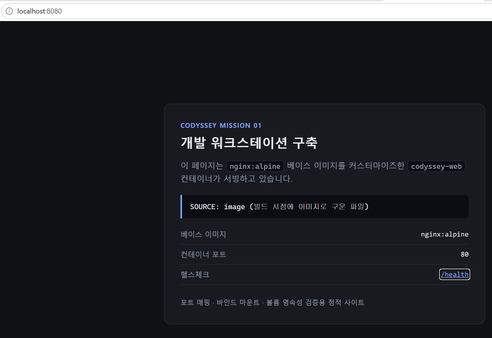
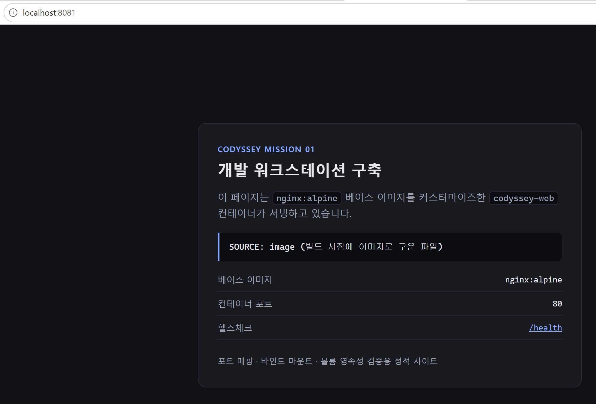
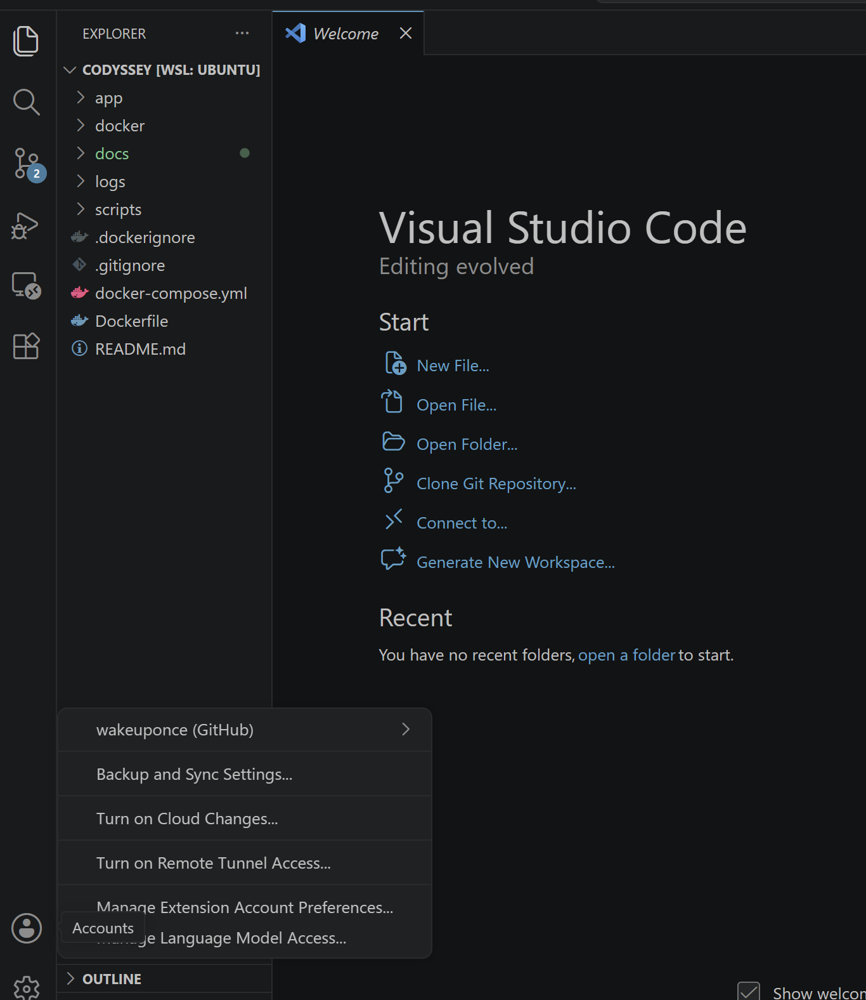

# Codyssey Mission 01 · 개발 워크스테이션 구축

터미널(Linux CLI) · Docker · Git/GitHub 세 가지 도구로 **"내 컴퓨터에서만 돌아가는" 문제를 없애는 재현 가능한 개발 환경**을 구축하고, 그 과정을 실행 결과로 증명한 기록입니다.

이 문서는 **평가자가 README만 읽고 동일 절차를 재현할 수 있도록** 작성했습니다. 모든 명령/출력은 실제 수행 결과이며, 전체 원본 로그는 [`logs/`](logs/) 에 있습니다.

---

## 1. 프로젝트 개요

| 항목 | 내용 |
|---|---|
| 목표 | 이미지/컨테이너 분리, 격리된 실행 환경, 포트·스토리지 연결 방식을 직접 검증하고 설명 가능한 형태로 정리 |
| 산출물 | 커스텀 웹 서버 이미지 + 실행 스크립트 + 전체 수행 로그 + 기술 문서 |
| 검증 원칙 | "명령을 쳐봤다"로 끝내지 않고, **동작이 실제로 달라지는 것**(접속 성공/거부, 데이터 유지/소실, 권한 거부)으로 증명 |

핵심 설계 원칙 3가지를 이 문서 전체에서 반복 확인합니다.

1. **이미지와 컨테이너의 분리** — 이미지는 빌드 시점에 고정된 읽기 전용 스냅샷, 컨테이너는 그 위에 쓰기 레이어를 얹은 실행 인스턴스
2. **격리된 실행 환경** — 컨테이너는 자기만의 네트워크·파일시스템 네임스페이스를 가지므로, 외부와 연결하려면 **명시적 통로**가 필요
3. **포트·스토리지 연결** — 그 통로가 각각 포트 매핑(`-p`)과 마운트/볼륨(`-v`)

---

## 2. 실행 환경

| 구분 | 값 | 확인 명령 |
|---|---|---|
| 호스트 OS | Windows 11 Home (10.0.26200) | `winver` |
| 개발 OS | Ubuntu 26.04 LTS (WSL2) | `lsb_release -a` |
| 커널 | `6.18.33.2-microsoft-standard-WSL2` | `uname -r` |
| 쉘 | bash 5.3.9(1)-release | `bash --version` |
| 터미널 | Windows Terminal → WSL2 Ubuntu | — |
| Docker Engine | **29.6.2** (build dfc4efb) | `docker --version` |
| Docker Compose | **v5.3.1** | `docker compose version` |
| Git | **2.53.0** | `git --version` |

> **왜 WSL2 + Docker Engine 인가**
> 호스트가 Windows 11 **Home** 이라 Docker Desktop / Docker Engine 어느 쪽을 택하든 WSL2 백엔드가 필요합니다. 그래서 WSL2 Ubuntu 안에 Docker Engine 을 직접 설치했습니다.
> 부수 효과로 **권한 실습이 정상 동작**합니다. Windows 파일시스템(`/mnt/c`)은 POSIX 권한을 흉내만 내기 때문에 `chmod` 의 변경 전/후 비교가 성립하지 않습니다. 그래서 작업 디렉토리를 Linux 네이티브 파일시스템인 `~/codyssey` 에 두었습니다. (→ [트러블슈팅 #1](#t1))

---

## 3. 저장소 구조

```
codyssey/
├── README.md                       # 이 문서
├── Dockerfile                      # 커스텀 이미지 정의 (nginx:alpine 기반)
├── docker-compose.yml              # 보너스: web + api 멀티 서비스
├── .dockerignore                   # 빌드 컨텍스트 제외 규칙
├── .gitignore                      # 비밀정보 커밋 차단 규칙 포함
├── app/                            # 웹 서버 정적 콘텐츠 (바인드 마운트 대상)
│   ├── index.html
│   └── style.css
├── docker/
│   └── default.conf                # nginx 설정 템플릿 (환경변수 주입)
├── scripts/                        # 재현용 실행 스크립트
│   ├── _lib.sh                     # 명령+출력을 함께 기록하는 헬퍼
│   ├── setup-docker-wsl.sh         # WSL2 Ubuntu 에 Docker Engine 설치
│   ├── 01-terminal-basics.sh
│   ├── 02-permissions.sh
│   ├── 03-docker-basics.sh
│   ├── 04-build-and-ports.sh
│   ├── 05-mount-and-volume.sh
│   ├── 06-compose.sh
│   └── 07-git-github.sh            # Git 설정 + 민감정보 스캔 + GitHub 생성/푸시
├── logs/                           # 위 스크립트의 실제 실행 로그 (증거)
│   ├── 01-terminal.txt
│   ├── 02-permissions.txt
│   ├── 03-docker-basics.txt
│   ├── 04-build-and-ports.txt
│   ├── 05-mount-and-volume.txt
│   ├── 06-compose.txt
│   └── 07-git-github.txt
└── docs/screenshots/               # 브라우저 접속 / VSCode 연동 화면
    ├── README.md                   # 각 화면의 텍스트 전사본 + 대응 CLI 검증
    ├── browser-8080.png
    ├── browser-8081.png
    └── vscode-github.png
```

**파일 형식에 대해** — 모든 증거는 코드(`.sh`, `Dockerfile`) 또는 텍스트 문서(`.md`, `.txt`, `.yml`, `.conf`)로만 커밋했습니다. 실행 로그는 `.txt`, nginx 설정은 `.conf` 입니다. (`docker/default.conf` 는 컨테이너 안에서는 `/etc/nginx/templates/default.conf.template` 이라는 이름으로 놓여야 하므로, 그 rename 은 `Dockerfile` 의 `COPY` 목적지 경로에서 처리합니다.)

스크린샷 `.png` 세 장은 미션이 요구하는 화면 증거라 그대로 두었지만, **이미지를 열지 않아도 되도록** 각 화면의 내용을 [`docs/screenshots/README.md`](docs/screenshots/README.md) 에 텍스트로 전사하고 같은 사실을 확인하는 CLI 명령을 함께 적어두었습니다.

`scripts/` 안의 파일은 모두 `755` 로 커밋되어 있어 `./scripts/01-terminal-basics.sh` 처럼 바로 실행됩니다. §7.2 에서 다룬 "실행하려면 `x` 가 필요하다"를 저장소 자신에게도 적용한 것입니다. (Git 이 실행 비트를 추적하려면 `core.filemode=true` 여야 하며, 이는 §7.12 에서 확인합니다.)

증거 수집 규칙("명령어 입력과 출력 결과가 함께 포함")을 지키기 위해 모든 스크립트는 [`scripts/_lib.sh`](scripts/_lib.sh) 의 `run()` 래퍼를 씁니다. 명령을 `$ ` 프롬프트와 함께 먼저 출력하고 실행하므로, 로그만 봐도 무엇을 쳤고 무엇이 나왔는지 알 수 있습니다.

---

## 4. 재현 방법

```bash
# 0) 사전 조건: WSL2 Ubuntu + Docker Engine
#    Windows 관리자 PowerShell 에서:  wsl --install -d Ubuntu   (설치 후 재부팅)
#    Ubuntu 안에서:                   bash scripts/setup-docker-wsl.sh
#    (설치 후 PowerShell 에서 wsl --shutdown 으로 재시작해야 docker 그룹이 적용됩니다)

git clone https://github.com/wakeuponce/codyssey-workstation.git
cd codyssey-workstation

bash scripts/01-terminal-basics.sh   | tee logs/01-terminal.txt
bash scripts/02-permissions.sh       | tee logs/02-permissions.txt
bash scripts/03-docker-basics.sh     | tee logs/03-docker-basics.txt
bash scripts/04-build-and-ports.sh   | tee logs/04-build-and-ports.txt
bash scripts/05-mount-and-volume.sh  | tee logs/05-mount-and-volume.txt
bash scripts/06-compose.sh           | tee logs/06-compose.txt

# 07 은 GitHub 계정을 건드리므로(저장소 생성/푸시) 재현 시에는 선택 사항입니다.
# gh 인증이 되어 있어야 하며, REPO_NAME 변수를 본인 것으로 바꿔 실행하세요.
# bash scripts/07-git-github.sh      | tee logs/07-git-github.txt
```

실행 후 브라우저에서 <http://localhost:8080> 과 <http://localhost:8081> 로 접속하면 §7.8 의 화면을 직접 확인할 수 있습니다.

> **개인 PC 종속 요소와 대체 방법**
> - 스크립트는 모두 **경로를 하드코딩하지 않습니다**. `$(dirname "$0")/..` 와 `$HOME` 으로 계산하므로 저장소를 어디에 두든 동작합니다.
> - 바인드 마운트만은 Docker 규칙상 **호스트 절대경로**가 필요해, 실행 시점에 `PROJECT="$(pwd)"` 로 계산해 넣습니다.
> - 호스트 포트 8080/8081/8082/8083 을 사용합니다. 이미 쓰는 포트가 있으면 스크립트의 `-p` 왼쪽 숫자만 바꾸면 됩니다.
> - 실습 파일은 저장소 밖 `~/codyssey-lab` 에 만들고 정리하므로 저장소가 더러워지지 않습니다.

---

## 5. 수행 항목 체크리스트

| # | 항목 | 상태 | 증거 |
|---|---|---|---|
| 1 | 터미널 기본 조작 (위치/목록/이동/생성/복사/이동·이름변경/삭제/내용확인/빈 파일) | ✅ | [§7.1](#71-터미널-기본-조작) · [logs/01](logs/01-terminal.txt) |
| 2 | 절대경로 vs 상대경로 비교 | ✅ | [§7.1](#71-터미널-기본-조작) |
| 3 | 파일 권한 변경 전/후 비교 (파일 1개 이상) | ✅ | [§7.2](#72-권한-실습) · [logs/02](logs/02-permissions.txt) |
| 4 | 디렉토리 권한 변경 전/후 비교 (디렉토리 1개 이상) | ✅ | [§7.2](#72-권한-실습) |
| 5 | Docker 설치 및 데몬 동작 점검 (`docker --version`, `docker info`) | ✅ | [§7.3](#73-docker-설치-및-점검) · [logs/03](logs/03-docker-basics.txt) |
| 6 | 이미지 다운로드/목록 (`pull`, `images`) | ✅ | [§7.4](#74-docker-기본-운영-명령) |
| 7 | 컨테이너 실행/중지/목록 (`run`, `ps`, `ps -a`, `stop`, `start`) | ✅ | [§7.4](#74-docker-기본-운영-명령) |
| 8 | 운영 명령 (`logs`, `stats`) | ✅ | [§7.4](#74-docker-기본-운영-명령) |
| 9 | `hello-world` 실행 성공 | ✅ | [§7.5](#75-hello-world--ubuntu-컨테이너-실습) |
| 10 | `ubuntu` 컨테이너 내부 진입 후 명령 수행 | ✅ | [§7.5](#75-hello-world--ubuntu-컨테이너-실습) |
| 11 | attach vs exec 차이 관찰·정리 | ✅ | [§7.6](#76-attach-vs-exec-차이) |
| 12 | 기존 Dockerfile 기반 커스텀 이미지 제작 | ✅ | [§7.7](#77-커스텀-이미지-빌드) · [logs/04](logs/04-build-and-ports.txt) |
| 13 | 포트 매핑 접속 성공 (2회) | ✅ | [§7.8](#78-포트-매핑-및-접속-증거) |
| 14 | 바인드 마운트 변경 반영 (호스트 변경 전/후) | ✅ | [§7.9](#79-바인드-마운트--호스트-변경-즉시-반영) · [logs/05](logs/05-mount-and-volume.txt) |
| 15 | Docker 볼륨 영속성 (컨테이너 삭제 전/후) | ✅ | [§7.10](#710-볼륨-영속성--컨테이너-삭제-전후) |
| 16 | Git 사용자 정보·기본 브랜치 설정 (`git config --list`) | ✅ | [§7.12](#712-git-설정-및-github-연동) · [logs/07](logs/07-git-github.txt) |
| 17 | GitHub 로그인 및 저장소 연동 | ✅ | [§7.12](#712-git-설정-및-github-연동) |
| 18 | 민감정보 마스킹 | ✅ | [§10](#10-보안--개인정보-보호) |
| **보너스** | | | |
| B1 | Compose 단일/멀티 서비스 실행 | ✅ | [§7.11](#711-보너스-docker-compose) · [logs/06](logs/06-compose.txt) |
| B2 | 컨테이너 간 네트워크 통신 확인 | ✅ | [§7.11](#711-보너스-docker-compose) |
| B3 | Compose 운영 명령 (`up`/`down`/`ps`/`logs`) | ✅ | [§7.11](#711-보너스-docker-compose) |
| B4 | 환경 변수 주입으로 설정 분리 | ✅ | [§7.8](#78-포트-매핑-및-접속-증거) |
| B5 | GitHub SSH 키 설정 | ✅ | [§7.12 ⑤](#712-git-설정-및-github-연동) |

---

## 6. 검증 방법 요약

| 무엇을 확인했나 | 어떤 명령으로 | 무엇을 보고 판단했나 | 결과 위치 |
|---|---|---|---|
| 권한이 실제로 동작을 막는가 | `chmod 400` 후 `echo >>` | `Permission denied` + 파일 내용 불변 | [§7.2](#72-권한-실습) |
| 디렉토리 `x` 의 의미 | `chmod 644 vault` 후 `ls -l` / `cd` | 이름은 보이나 상세정보 `-?????????` + 진입 거부 | [§7.2](#72-권한-실습) |
| 데몬이 살아있는가 | `docker version`, `docker info` | `Server:` 블록 출력 | [§7.3](#73-docker-설치-및-점검) |
| attach 와 exec 의 차이 | `docker exec` / `echo exit \| docker attach` | exec 후 `Up`, attach 후 `Exited (0)` | [§7.6](#76-attach-vs-exec-차이) |
| 커스텀 이미지가 적용됐는가 | `docker inspect --format` | LABEL/ENV 값 출력 | [§7.7](#77-커스텀-이미지-빌드) |
| 포트 매핑이 동작하는가 | `curl -i http://localhost:8080/` | `HTTP/1.1 200 OK` | [§7.8](#78-포트-매핑-및-접속-증거) |
| 포트 매핑이 **왜** 필요한가 | `-p` 없이 실행 후 호스트에서 `curl` | 호스트 `curl` 실패 + 컨테이너 내부 `curl` 성공 | [§7.8](#78-포트-매핑-및-접속-증거) |
| 환경변수 주입이 됐는가 | `curl /health` | `env=dev` / `env=prod` / `env=compose` | [§7.8](#78-포트-매핑-및-접속-증거) |
| 바인드 마운트가 반영되는가 | 호스트 파일 `sed` 수정 후 `curl` | 재빌드 없이 응답 변경, 동시에 8080은 불변 | [§7.9](#79-바인드-마운트--호스트-변경-즉시-반영) |
| 볼륨이 영속적인가 | `docker rm -f` 후 새 컨테이너에서 `cat` | 삭제된 컨테이너 ID가 적힌 파일이 그대로 조회됨 | [§7.10](#710-볼륨-영속성--컨테이너-삭제-전후) |
| 서비스 디스커버리가 되는가 | `docker compose exec web curl http://api/` | 이름만으로 응답 수신 + 없는 이름은 DNS 실패 | [§7.11](#711-보너스-docker-compose) |

---

## 7. 수행 로그

> **발췌 표기 규칙**
> 아래 블록은 원본 로그의 **발췌**입니다. 가독성을 위해 반복되는 `cd /home/wakeuponce/... &&` 접두사와 긴 절대경로를 축약했습니다. **명령의 출력과 오류 메시지는 원문 그대로** 옮겼으며, 축약 없는 원본은 [`logs/`](logs/) 에 있습니다.
> 오류 메시지 앞의 `scripts/_lib.sh: line 8:` 접두사는 명령을 `run()` 헬퍼의 `eval` 로 실행하기 때문에 붙는 것으로, 셸이 직접 실행했다면 `bash:` 로 표시됩니다.

### 7.1 터미널 기본 조작

전체 로그: [`logs/01-terminal.txt`](logs/01-terminal.txt) · 스크립트: [`scripts/01-terminal-basics.sh`](scripts/01-terminal-basics.sh)

**현재 위치 확인 + 절대경로 vs 상대경로**

```bash
$ pwd
/home/wakeuponce/codyssey

# 절대경로: / 에서 시작하는 완전한 주소. 현재 위치와 무관하게 항상 같은 곳을 가리킨다.
$ cd /home/wakeuponce/codyssey-lab/project && pwd
/home/wakeuponce/codyssey-lab/project

# 상대경로: 현재 위치 기준. '.' = 현재, '..' = 상위
$ cd /home/wakeuponce/codyssey-lab/project/src && pwd && cd .. && pwd
/home/wakeuponce/codyssey-lab/project/src
/home/wakeuponce/codyssey-lab/project

# 같은 대상을 두 방식으로 가리키기 (src 에서 backup 을 지목)
$ ls -d /home/wakeuponce/codyssey-lab/backup     # 절대경로
/home/wakeuponce/codyssey-lab/backup
$ ls -d ../../backup                              # 상대경로 - 같은 디렉토리다
../../backup
```

**빈 파일 생성 / 내용 확인 / 숨김 파일 포함 목록**

```bash
$ touch empty.txt && ls -l empty.txt
-rw-r--r-- 1 wakeuponce wakeuponce 0 Jul 29 15:27 empty.txt

$ printf 'hello codyssey\nline2\n' > note.txt
$ cat note.txt
hello codyssey
line2

$ ls -l                # .hidden-config 이 안 보인다
total 8
-rw-r--r-- 1 wakeuponce wakeuponce    0 Jul 29 15:27 empty.txt
-rw-r--r-- 1 wakeuponce wakeuponce   21 Jul 29 15:27 note.txt
drwxr-xr-x 2 wakeuponce wakeuponce 4096 Jul 29 15:27 src

$ ls -la               # -a 를 붙이면 . 으로 시작하는 항목까지 보인다
total 16
drwxr-xr-x 3 wakeuponce wakeuponce 4096 Jul 29 15:27 .
drwxr-xr-x 4 wakeuponce wakeuponce 4096 Jul 29 15:27 ..
-rw-r--r-- 1 wakeuponce wakeuponce    0 Jul 29 15:27 .hidden-config
-rw-r--r-- 1 wakeuponce wakeuponce    0 Jul 29 15:27 empty.txt
-rw-r--r-- 1 wakeuponce wakeuponce   21 Jul 29 15:27 note.txt
drwxr-xr-x 2 wakeuponce wakeuponce 4096 Jul 29 15:27 src
```

**복사 / 이름변경·이동 / 삭제**

```bash
$ cp note.txt ~/codyssey-lab/backup/note-copy.txt      # 파일 복사
$ cp -r ~/codyssey-lab/project ~/codyssey-lab/backup/project-snapshot   # 디렉토리는 -r

$ mv note.txt renamed.txt        # 목적지가 새 이름이면 rename
$ mv renamed.txt src/renamed.txt # 목적지가 디렉토리면 move

$ rm empty.txt                   # 파일 삭제 (휴지통 없음)
$ rm -r ~/codyssey-lab/backup/project-snapshot   # 디렉토리는 -r
```

---

### 7.2 권한 실습

전체 로그: [`logs/02-permissions.txt`](logs/02-permissions.txt) · 스크립트: [`scripts/02-permissions.sh`](scripts/02-permissions.sh)

#### 읽는 법

```
-rwxr-xr-x
│└┬┘└┬┘└┬┘
│ │  │  └── others(기타)   r-x
│ │  └───── group(그룹)    r-x
│ └──────── user(소유자)   rwx
└────────── 종류 (- 파일, d 디렉토리, l 심볼릭링크)
```

`r=4, w=2, x=1` 을 더해 user/group/others 순으로 나열합니다.

| 표기 | user | group | others | 주 용도 |
|---|---|---|---|---|
| **755** | 7 = `rwx` (4+2+1) | 5 = `r-x` (4+0+1) | 5 = `r-x` (4+0+1) | 디렉토리, 실행 스크립트 |
| **644** | 6 = `rw-` (4+2+0) | 4 = `r--` (4+0+0) | 4 = `r--` (4+0+0) | 일반 파일 |

**같은 글자라도 파일과 디렉토리에서 의미가 다릅니다.**

| | `r` | `w` | `x` |
|---|---|---|---|
| 파일 | 내용 읽기 | 내용 수정 | 실행 |
| 디렉토리 | 항목 **목록** 조회 | 항목 추가/삭제 | **진입**(통과) |

#### ① 파일 — 실행 권한 `x` (변경 전/후)

```bash
$ umask
0022                                    # 그래서 새 파일이 666-022=644 로 생성된다

# ── 변경 전 ──
$ ls -l demo.sh
-rw-r--r-- 1 wakeuponce wakeuponce 54 Jul 29 15:28 demo.sh
$ ./demo.sh
scripts/_lib.sh: line 8: ./demo.sh: Permission denied      # x 가 없어 실행 거부
[exit=126]

$ chmod 755 demo.sh

# ── 변경 후 ──
$ ls -l demo.sh
-rwxr-xr-x 1 wakeuponce wakeuponce 54 Jul 29 15:28 demo.sh
$ ./demo.sh
스크립트 실행 성공                        # 실행됨
```

#### ② 파일 — 쓰기 권한 `w` (변경 전/후)

```bash
# ── 변경 전 (644) ──
$ stat -c '%A (%a) %n' secret.txt
-rw-r--r-- (644) secret.txt
$ echo 'appended before chmod' >> secret.txt && cat secret.txt
original content
appended before chmod                   # 쓰기 성공

$ chmod 400 secret.txt

# ── 변경 후 (400) ──
$ stat -c '%A (%a) %n' secret.txt
-r-------- (400) secret.txt
$ cat secret.txt                        # 읽기는 여전히 가능
original content
appended before chmod
$ echo 'appended after chmod' >> secret.txt
scripts/_lib.sh: line 8: secret.txt: Permission denied      # 쓰기는 거부
[exit=1]
$ cat secret.txt                        # 내용이 그대로임을 확인
original content
appended before chmod
```

#### ③ 디렉토리 — `x` 는 진입, `r` 은 목록 (변경 전/후)

```bash
# ── 변경 전 (755) ──
$ stat -c '%A (%a) %n' vault
drwxr-xr-x (755) vault
$ cd vault && cat data.txt
inside vault                            # 진입·읽기 모두 가능

$ chmod 644 vault                       # 디렉토리에서 x 를 제거

# ── 변경 후 (644) ──
$ stat -c '%A (%a) %n' vault
drw-r--r-- (644) vault

$ ls vault                              # r 이 있어 '이름'은 보인다
data.txt

$ ls -l vault                           # 하지만 x 가 없어 stat 을 못한다
total 0
-????????? ? ? ? ?            ? data.txt

$ cd vault
scripts/_lib.sh: line 8: cd: .../perm/vault: Permission denied   # 진입 거부
[exit=1]
$ cat vault/data.txt
cat: .../perm/vault/data.txt: Permission denied                  # 통과 불가 → 읽기 불가
[exit=1]
```

> 위 `-????????? ? ? ? ?` 출력이 `r` 과 `x` 의 역할 차이를 가장 잘 보여줍니다. **이름 목록은 읽었지만(`r`), 각 항목의 메타데이터를 얻으러 디렉토리를 통과하지 못한(`x` 없음)** 상태입니다.

```bash
$ chmod 555 vault                       # x 복구, w 는 없음
$ stat -c '%A (%a) %n' vault
dr-xr-xr-x (555) vault
$ cd vault && cat data.txt
inside vault                            # 진입·읽기 가능
$ touch vault/newfile.txt
touch: cannot touch '.../perm/vault/newfile.txt': Permission denied   # w 없어 생성 거부
[exit=1]

$ chmod 755 vault                       # 표준 권한 복구
$ stat -c '%A (%a) %n' vault
drwxr-xr-x (755) vault
$ touch vault/newfile.txt && ls -l vault # 이제 생성 가능
total 4
-rw-r--r-- 1 wakeuponce wakeuponce 13 Jul 29 15:28 data.txt
-rw-r--r-- 1 wakeuponce wakeuponce  0 Jul 29 15:28 newfile.txt
```

**왜 755 / 644 가 기본값처럼 쓰이는가**
- 디렉토리 `755` — 남들도 들어와서 볼 수는 있어야 하지만(`r-x`), 내용물을 바꾸는 것은 소유자만(`w`).
- 파일 `644` — 남들이 읽을 수는 있어야 하지만(`r--`), 수정은 소유자만(`rw-`).
- 파일에 `x` 를 기본으로 주지 않는 이유 — 실행 가능한 파일이 늘어날수록 공격면이 넓어집니다.

---

### 7.3 Docker 설치 및 점검

전체 로그: [`logs/03-docker-basics.txt`](logs/03-docker-basics.txt)

```bash
$ docker --version
Docker version 29.6.2, build dfc4efb
```

`docker version` 은 **클라이언트와 서버(데몬)를 함께** 보여줍니다. `Server:` 블록이 나온다는 것은 데몬 소켓 통신에 성공했다는 뜻입니다.

```bash
$ docker version
Client: Docker Engine - Community
 Version:           29.6.2
 API version:       1.55
 Go version:        go1.26.5
 Git commit:        dfc4efb
 Built:             Thu Jul 16 16:12:21 2026
 OS/Arch:           linux/amd64
 Context:           default

Server: Docker Engine - Community
 Engine:
  Version:          29.6.2
  API version:      1.55 (minimum version 1.40)
  Go version:       go1.26.5
  Git commit:       3d80467
  Built:            Thu Jul 16 16:12:21 2026
  OS/Arch:          linux/amd64
  Experimental:     false
 containerd:
  Version:          v2.2.6
 runc:
  Version:          1.3.6
```

```bash
$ docker info | head -40
Client: Docker Engine - Community
 Version:    29.6.2
 Context:    default
 Debug Mode: false
 Plugins:
  buildx: Docker Buildx (Docker Inc.)
    Version:  v0.35.0
  compose: Docker Compose (Docker Inc.)
    Version:  v5.3.1

Server:
 Containers: 2
  Running: 2
  Paused: 0
  Stopped: 0
 Images: 4
 Server Version: 29.6.2
 Storage Driver: overlayfs
  driver-type: io.containerd.snapshotter.v1
 Logging Driver: json-file
 Cgroup Driver: systemd
 Cgroup Version: 2
```

> 데몬이 죽어 있으면 이 지점에서 `Cannot connect to the Docker daemon at unix:///var/run/docker.sock` 이 납니다. `Server:` 블록의 존재 자체가 데몬 동작 증거입니다.

---

### 7.4 Docker 기본 운영 명령

**이미지 — 다운로드 / 목록**

```bash
$ docker pull hello-world:latest
$ docker pull ubuntu:24.04

$ docker images
IMAGE                ID             DISK USAGE   CONTENT SIZE   EXTRA
codyssey-web:1.0     3e42bd83e2a6       92.9MB         26.1MB   U
hello-world:latest   c3cbe1cc1aa5       25.9kB         9.49kB
httpd:alpine         1b766f17b840       97.3MB         21.9MB
ubuntu:24.04         4fbb8e6a8395        119MB         31.7MB
```

`pull` 은 **내려받기만** 합니다. 컨테이너는 만들지 않습니다.

**운영 — 로그**

```bash
$ docker run -d --name ticker ubuntu:24.04 bash -c 'for i in 1 2 3 4 5; do echo "tick $i"; sleep 1; done'
9f3df722e38301c21d36fd816dde794a45513d0700c0c090d7c99618bea7cf30

$ docker logs ticker
tick 1
tick 2
tick 3
tick 4
tick 5

$ docker logs -t ticker | tail -3
2026-07-29T07:33:08.238531806Z tick 3
2026-07-29T07:33:09.241049292Z tick 4
2026-07-29T07:33:10.244312477Z tick 5
```

컨테이너의 **표준출력/표준에러가 곧 로그**입니다. 애플리케이션이 파일이 아니라 stdout 으로 찍어야 하는 이유가 여기 있습니다.

**운영 — 리소스 사용량**

```bash
$ docker stats --no-stream
CONTAINER ID   NAME                CPU %     MEM USAGE / LIMIT     MEM %     NET I/O           BLOCK I/O     PIDS
c94c92401189   ubuntu-idle         0.00%     1.047MiB / 15.41GiB   0.01%     516B / 126B       0B / 0B       1
ab047e18bf2a   codyssey-web-8081   0.00%     19.25MiB / 15.41GiB   0.12%     3.83kB / 2.97kB   0B / 16.4kB   23
```

`sleep` 만 도는 컨테이너는 1.0MiB / PID 1개인 반면, nginx 컨테이너는 19MiB / PID 23개를 씁니다. 컨테이너가 VM 이 아니라 **프로세스 묶음**이라는 것이 수치로 드러납니다.

`stats` 는 기본이 실시간 스트리밍이라, 로그로 남기려면 `--no-stream` 이 필요합니다.

**이미지와 컨테이너의 수명주기 분리**

```bash
$ docker ps -a --format 'table {{.Names}}\t{{.Image}}\t{{.Status}}'
NAMES               IMAGE              STATUS
ubuntu-idle         ubuntu:24.04       Up 2 seconds
ticker              ubuntu:24.04       Exited (0) 4 seconds ago
ubuntu-lab          ubuntu:24.04       Exited (137) 10 seconds ago
hello-lab           hello-world        Exited (0) 26 seconds ago
codyssey-web-8081   codyssey-web:1.0   Up 55 minutes (healthy)
codyssey-web-8080   codyssey-web:1.0   Up 55 minutes (healthy)

$ docker rm -f hello-lab ubuntu-lab ticker ubuntu-idle
hello-lab
ubuntu-lab
ticker
ubuntu-idle

$ docker ps -a --format 'table {{.Names}}\t{{.Status}}'
NAMES               STATUS
codyssey-web-8081   Up 55 minutes (healthy)
codyssey-web-8080   Up 55 minutes (healthy)
                                        # 실습용 컨테이너는 모두 사라졌지만

$ docker images
IMAGE                ID             DISK USAGE   CONTENT SIZE   EXTRA
codyssey-web:1.0     3e42bd83e2a6       92.9MB         26.1MB   U
hello-world:latest   c3cbe1cc1aa5       25.9kB         9.49kB
httpd:alpine         1b766f17b840       97.3MB         21.9MB
ubuntu:24.04         4fbb8e6a8395        119MB         31.7MB
                                        # 이미지는 그대로 남아있다
```

---

### 7.5 hello-world / ubuntu 컨테이너 실습

```bash
$ docker run --name hello-lab hello-world

Hello from Docker!
This message shows that your installation appears to be working correctly.

To generate this message, Docker took the following steps:
 1. The Docker client contacted the Docker daemon.
 2. The Docker daemon pulled the "hello-world" image from the Docker Hub.
    (amd64)
 3. The Docker daemon created a new container from that image which runs the
    executable that produces the output you are currently reading.
 4. The Docker daemon streamed that output to the Docker client, which sent it
    to your terminal.
```

```bash
$ docker ps                              # 종료된 컨테이너는 안 보인다
CONTAINER ID   IMAGE     COMMAND   CREATED   STATUS    PORTS     NAMES

$ docker ps -a --filter name=hello-lab   # -a 를 붙여야 보인다
CONTAINER ID   IMAGE         COMMAND    CREATED        STATUS                              NAMES
6caa4f57612c   hello-world   "/hello"   1 second ago   Exited (0) Less than a second ago   hello-lab
```

**ubuntu 컨테이너 — 왜 바로 종료되는가**

```bash
# PID 1 로 뜬 명령이 끝나는 순간 컨테이너도 끝난다
$ docker run --rm ubuntu:24.04 echo '컨테이너 안에서 실행된 echo'
컨테이너 안에서 실행된 echo

# 살려두려면 PID 1 이 계속 살아있어야 한다
$ docker run -di --name ubuntu-lab ubuntu:24.04 bash
11d78bf157049218e574aa6b2100b4f19850aea84886de6d13cf318e452ebeb8

$ docker ps --filter name=ubuntu-lab
CONTAINER ID   IMAGE          COMMAND   CREATED                  STATUS                  NAMES
11d78bf15704   ubuntu:24.04   "bash"    Less than a second ago   Up Less than a second   ubuntu-lab

# exec - 실행 중인 컨테이너 안에서 '새 프로세스'를 띄운다
$ docker exec ubuntu-lab ls -l /
total 48
lrwxrwxrwx   1 root root    7 Apr 22  2024 bin -> usr/bin
drwxr-xr-x   2 root root 4096 Apr 22  2024 boot
drwxr-xr-x   5 root root  340 Jul 29 06:31 dev
drwxr-xr-x   1 root root 4096 Jul 29 06:31 etc
drwxr-xr-x   3 root root 4096 Jun 10 02:12 home
lrwxrwxrwx   1 root root    7 Apr 22  2024 lib -> usr/lib
...
dr-xr-xr-x 406 root root    0 Jul 29 06:31 proc
drwx------   2 root root 4096 Jun 10 02:12 root
dr-xr-xr-x  13 root root    0 Jul 29 06:30 sys
drwxrwxrwt   2 root root 4096 Jun 10 02:12 tmp

$ docker exec ubuntu-lab sh -c 'echo "컨테이너 내부 사용자: $(whoami)" && head -2 /etc/os-release'
컨테이너 내부 사용자: root
PRETTY_NAME="Ubuntu 24.04.4 LTS"
NAME="Ubuntu"
```

호스트는 Ubuntu **26.04** 인데 컨테이너 안은 **24.04** 이고, 호스트 사용자는 `wakeuponce` 인데 컨테이너 안은 `root` 입니다. 파일시스템과 사용자 네임스페이스가 분리돼 있다는 것을 한눈에 보여줍니다.

> `$(whoami)` 를 작은따옴표로 감싼 이유는 [트러블슈팅 #4](#4-볼륨-영속성-증거에-컨테이너-id-대신-호스트명이-기록된-문제) 와 같습니다. 큰따옴표를 쓰면 호스트 셸이 먼저 치환해버려 `wakeuponce` 가 찍힙니다.

---

### 7.6 attach vs exec 차이

| | `docker exec` | `docker attach` |
|---|---|---|
| 하는 일 | 컨테이너 안에 **새 프로세스**를 추가로 띄움 | 이미 도는 **PID 1 의 입출력에 연결** |
| 빠져나오면 | 그 프로세스만 끝남. 컨테이너는 계속 실행 | PID 1 을 끝내면 **컨테이너도 종료** |
| 주 용도 | 디버깅, 일회성 명령 | PID 1 의 콘솔을 직접 봐야 할 때 |

**실측 — exec 는 상태를 바꾸지 못한다**

```bash
$ docker exec ubuntu-lab ls -l /
$ docker exec ubuntu-lab bash -c "echo 'ephemeral data' > /tmp/tmp.txt && cat /tmp/tmp.txt"
ephemeral data

$ docker ps --filter name=ubuntu-lab --format 'table {{.Names}}\t{{.Status}}'
NAMES        STATUS
ubuntu-lab   Up 2 seconds            # exec 를 여러 번 해도 여전히 Up
```

**실측 — attach 는 컨테이너를 종료시킨다**

```bash
$ docker ps --filter name=ubuntu-lab --format '{{.Names}} -> {{.Status}}'
ubuntu-lab -> Up 1 second

$ echo exit | docker attach ubuntu-lab   # PID 1 인 bash 에 exit 를 흘려보냄

$ docker ps --filter name=ubuntu-lab --format '{{.Names}} -> {{.Status}}'
                                          # 실행 목록에서 사라짐

$ docker ps -a --filter name=ubuntu-lab --format 'table {{.Names}}\t{{.Status}}'
NAMES        STATUS
ubuntu-lab   Exited (0) Less than a second ago
```

**중지 ≠ 삭제** — `stop` 한 컨테이너는 상태가 보존되어 `start` 로 되살아납니다.

```bash
$ docker start ubuntu-lab
ubuntu-lab
$ docker exec ubuntu-lab cat /tmp/tmp.txt
ephemeral data                            # 아까 exec 로 만든 파일이 그대로 있다
```

단, 이 데이터는 **컨테이너의 쓰기 레이어**에 있어서 `docker rm` 하면 사라집니다. → [§7.10](#710-볼륨-영속성--컨테이너-삭제-전후)

---

### 7.7 커스텀 이미지 빌드

전체 로그: [`logs/04-build-and-ports.txt`](logs/04-build-and-ports.txt) · 정의: [`Dockerfile`](Dockerfile)

**선택한 기존 베이스**: 방식 (A) — 웹 서버 베이스 이미지 [`nginx:alpine`](https://hub.docker.com/_/nginx) + 정적 콘텐츠/설정 교체

**내가 적용한 커스텀 포인트와 목적**

| # | 커스텀 포인트 | 목적 |
|---|---|---|
| 1 | `COPY app/ /usr/share/nginx/html/` | 기본 nginx 환영 페이지를 미션용 정적 사이트로 교체 |
| 2 | `COPY docker/default.conf` + `ENV NGINX_PORT / APP_ENV` | **설정과 코드의 분리.** listen 포트와 `/health` 응답을 이미지 재빌드 없이 환경변수로 바꾼다 |
| 3 | `RUN apk add --no-cache curl` | HEALTHCHECK 와 컨테이너 간 통신 검증에 필요. `--no-cache` 로 패키지 인덱스를 남기지 않아 이미지가 커지지 않게 함 |
| 4 | `HEALTHCHECK ... CMD curl -fsS .../health` | 컨테이너가 "떠 있음"과 "정상 응답함"을 Docker 가 구분해 판정하게 함 |
| 5 | `LABEL org.opencontainers.image.*` | OCI 표준 라벨로 이미지 출처·용도를 메타데이터에 남김 |

> **설계 노트 1 — `HEALTHCHECK` 를 shell 형식으로 쓴 이유**
> `CMD ["curl", ...]` (exec 형식)으로 쓰면 `${NGINX_PORT}` 가 확장되지 않습니다. shell 형식으로 써야 런타임에 셸이 환경변수를 풀어줍니다.
>
> **설계 노트 2 — nginx 템플릿과 `$uri` 의 공존**
> `nginx:alpine` 의 엔트리포인트는 `/etc/nginx/templates/*.template` 를 `envsubst` 로 치환합니다. 이때 **실제로 정의된 환경변수 이름만** 치환 목록에 넘기므로, 설정 파일 안의 nginx 런타임 변수(`$uri` 등)는 지워지지 않고 보존됩니다.

**빌드**

```bash
$ docker build -t codyssey-web:1.0 .
#1 [internal] load build definition from Dockerfile
#1 DONE 0.0s
#2 [internal] load metadata for docker.io/library/nginx:alpine
#2 DONE 0.8s
#3 [internal] load .dockerignore
#3 DONE 0.0s
#4 [internal] load build context
#4 DONE 0.0s
#5 [1/4] FROM docker.io/library/nginx:alpine@sha256:4a73073bd557c65b759505da037898b61f1be6cbcc3c2c3aeac22d2a470c1752
#5 DONE 0.0s
#6 [2/4] RUN apk add --no-cache curl
#6 CACHED
#7 [3/4] COPY docker/default.conf /etc/nginx/templates/default.conf.template
#7 CACHED
#8 [4/4] COPY app/ /usr/share/nginx/html/
#8 DONE 0.0s
#9 exporting to image
#9 naming to docker.io/library/codyssey-web:1.0 done
#9 DONE 0.2s
```

이 로그는 **재빌드** 결과입니다. `#6 RUN apk add curl` 과 `#7 COPY docker/default.conf` 는 `CACHED` 로 재사용됐고 `#8 COPY app/` 만 다시 실행됐습니다. 직전에 `app/` 파일 권한을 `644` 로 정리하면서 그 레이어의 내용이 달라졌기 때문입니다 — Docker 는 파일 본문뿐 아니라 **권한 같은 메타데이터까지** 레이어 해시에 반영합니다.

Dockerfile 에서 잘 바뀌지 않는 `RUN apk add` 를 위에, 자주 바뀌는 `COPY` 를 아래에 둔 이유가 이것입니다. 아래쪽 레이어가 무효화돼도 위쪽 패키지 설치는 다시 하지 않으므로 재빌드가 1초 안에 끝납니다. 반대로 위쪽 레이어가 바뀌면 **그 아래 레이어는 전부 다시** 만들어집니다. 최초 빌드에서는 `nginx:alpine` 레이어 다운로드(20.31MB 등)와 `apk add curl` 실행이 실제로 수행됩니다.

**커스텀이 실제로 이미지에 새겨졌는지 확인**

```bash
$ docker inspect codyssey-web:1.0 --format 'Labels: {{json .Config.Labels}}'
Labels: {"maintainer":"NGINX Docker Maintainers <docker-maint@nginx.com>",
         "org.opencontainers.image.authors":"codyssey-student",
         "org.opencontainers.image.description":"Codyssey Mission 01 custom nginx image",
         "org.opencontainers.image.title":"codyssey-web"}

$ docker inspect codyssey-web:1.0 --format 'Env: {{json .Config.Env}}'
Env: ["PATH=/usr/local/sbin:/usr/local/bin:/usr/sbin:/usr/bin:/sbin:/bin",
      "NGINX_VERSION=1.31.3","PKG_RELEASE=1","DYNPKG_RELEASE=1",
      "NJS_VERSION=1.0.0","NJS_RELEASE=1","ACME_VERSION=0.4.1",
      "NGINX_PORT=80","APP_ENV=dev"]
```

두 출력 모두 **베이스 이미지의 값과 내가 추가한 값이 합쳐져** 있습니다. `maintainer` 라벨과 `NGINX_VERSION` 등은 `nginx:alpine` 에서 상속된 것이고, `org.opencontainers.image.*` 와 `NGINX_PORT`/`APP_ENV` 가 이 Dockerfile 이 얹은 값입니다. 커스텀 이미지가 베이스를 **대체하는 게 아니라 그 위에 쌓인다**는 것을 보여줍니다.

---

### 7.8 포트 매핑 및 접속 증거

**1회차 — 8080 → 80**

```bash
$ docker run -d -p 8080:80 --restart unless-stopped --name codyssey-web-8080 codyssey-web:1.0
89b20295a12d54b778a1aa5cd0b0e66ed4ba94e106abc76dd44b44e90d2ea7b3

$ docker ps --format 'table {{.Names}}\t{{.Ports}}\t{{.Status}}'
NAMES               PORTS                                     STATUS
codyssey-web-8080   0.0.0.0:8080->80/tcp, [::]:8080->80/tcp   Up 2 seconds (health: starting)

$ curl -sS -i http://localhost:8080/ | head -12
HTTP/1.1 200 OK
Server: nginx/1.31.3
Date: Wed, 29 Jul 2026 12:36:58 GMT
Content-Type: text/html
Content-Length: 1142
Last-Modified: Wed, 29 Jul 2026 06:37:50 GMT
Connection: keep-alive
ETag: "6a699fbe-476"
Accept-Ranges: bytes

<!doctype html>
<html lang="ko">
```

**2회차 — 8081 → 80 (같은 이미지, 환경변수만 교체)**

```bash
$ docker run -d -p 8081:80 -e APP_ENV=prod --restart unless-stopped --name codyssey-web-8081 codyssey-web:1.0
6eb4bb3bcb46802b36bd90b6d0a7c475bd29ade4d16a56a4a4983584136f57d1

$ docker ps --format 'table {{.Names}}\t{{.Ports}}\t{{.Status}}'
NAMES               PORTS                                     STATUS
codyssey-web-8081   0.0.0.0:8081->80/tcp, [::]:8081->80/tcp   Up 2 seconds (health: starting)
codyssey-web-8080   0.0.0.0:8080->80/tcp, [::]:8080->80/tcp   Up 5 seconds (health: starting)
```

컨테이너 포트는 **둘 다 80** 이지만 호스트 포트가 달라 충돌하지 않습니다. 이것이 "이미지 하나 → 컨테이너 여러 개"가 가능한 이유입니다.

**환경 변수 주입 확인 (보너스 B4) — 코드는 그대로, 설정만 다름**

```bash
$ curl -sS http://localhost:8080/health
ok env=dev port=80

$ curl -sS http://localhost:8081/health
ok env=prod port=80
```

**HEALTHCHECK 동작 확인**

```bash
$ docker ps --format 'table {{.Names}}\t{{.Status}}'
NAMES               STATUS
codyssey-web-8081   Up 14 seconds (healthy)
codyssey-web-8080   Up 17 seconds (healthy)

$ docker inspect codyssey-web-8080 --format 'Health={{.State.Health.Status}}'
Health=healthy

$ docker inspect codyssey-web-8080 --format 'LastCheck={{json (index .State.Health.Log 0).Output}}'
LastCheck="ok env=dev port=80\n"
```

#### 포트 매핑이 **왜** 필요한가 — `-p` 없이 띄워서 비교

```bash
$ docker run -d --name codyssey-web-noport codyssey-web:1.0

$ docker ps --format 'table {{.Names}}\t{{.Ports}}'
NAMES                 PORTS
codyssey-web-noport   80/tcp                                    # 매핑 없음
codyssey-web-8081     0.0.0.0:8081->80/tcp, [::]:8081->80/tcp
codyssey-web-8080     0.0.0.0:8080->80/tcp, [::]:8080->80/tcp

# 컨테이너 '안에서는' 웹서버가 멀쩡히 동작한다
$ docker exec codyssey-web-noport curl -sS http://localhost:80/health
ok env=dev port=80

# 하지만 호스트에서는 닿을 방법이 없다
$ curl -sS --max-time 5 http://localhost:8082/health
curl: (7) Failed to connect to localhost port 8082 after 0 ms: Could not connect to server

# 컨테이너는 브리지 네트워크상의 사설 IP 를 가질 뿐이다
$ docker inspect codyssey-web-noport --format 'ContainerIP={{range .NetworkSettings.Networks}}{{.IPAddress}}{{end}}'
ContainerIP=172.17.0.4
```

**결론** — 컨테이너는 자기만의 **네트워크 네임스페이스**를 갖습니다. 컨테이너의 80 포트는 호스트의 80 포트가 아니라 "컨테이너 안의" 80 포트입니다. 컨테이너에 붙은 `172.17.0.4` 는 Docker 브리지 내부에서만 유효한 주소라 브라우저가 알 수 없습니다. 그래서 `-p 8080:80` 이라는 **명시적 통로**를 열어줘야 외부가 접근할 수 있습니다. 이 격리가 기본값이기 때문에, 의도치 않게 서비스가 외부에 노출되는 일이 생기지 않습니다.

#### 브라우저 접속 증거

WSL2 는 `localhost` 를 Windows 호스트와 공유하므로, Windows 브라우저에서 그대로 접속됩니다. Windows 측에서 확인한 결과:

```powershell
PS> Invoke-WebRequest http://localhost:8080/health -UseBasicParsing
http://localhost:8080/health -> HTTP 200 : ok env=dev port=80
PS> Invoke-WebRequest http://localhost:8081/health -UseBasicParsing
http://localhost:8081/health -> HTTP 200 : ok env=prod port=80
```

| 주소 | 화면 |
|---|---|
| `http://localhost:8080` |  |
| `http://localhost:8081` |  |

두 캡처 모두 **주소창(`localhost:8080` / `localhost:8081`)과 응답 화면이 한 장에** 들어가 있습니다. 이미지를 열 수 없는 환경을 위해 주소창 문자열과 페이지 본문을 [`docs/screenshots/README.md`](docs/screenshots/README.md#1-browser-8080png--포트-매핑-1회차) 에 텍스트로 전사해 두었습니다.

주소창의 `:8080` 은 **호스트 포트**이고 페이지 본문에 표시된 "컨테이너 포트 80" 은 **컨테이너 내부 포트**입니다. 이 둘이 다른데도 화면이 뜬다는 사실 자체가 `-p 8080:80` 이 동작했다는 증거입니다.

---

### 7.9 바인드 마운트 — 호스트 변경 즉시 반영

전체 로그: [`logs/05-mount-and-volume.txt`](logs/05-mount-and-volume.txt)

```bash
$ docker run -d -p 8083:80 -v /home/wakeuponce/codyssey/app:/usr/share/nginx/html:ro \
    --name codyssey-web-bind codyssey-web:1.0

$ docker inspect codyssey-web-bind --format '{{json .Mounts}}'
[{"Type":"bind","Source":"/home/wakeuponce/codyssey/app",
  "Destination":"/usr/share/nginx/html","Mode":"ro","RW":false,"Propagation":"rprivate"}]
```

> 호스트 경로는 반드시 **절대경로**여야 합니다. 상대경로를 쓰면 Docker 가 이름 있는 볼륨으로 오해합니다.

**변경 전**

```bash
$ grep 'class="marker"' app/index.html
    <p class="marker" id="marker">SOURCE: image (빌드 시점에 이미지로 구운 파일)</p>

$ curl -sS http://localhost:8083/ | grep 'class="marker"'
    <p class="marker" id="marker">SOURCE: image (빌드 시점에 이미지로 구운 파일)</p>
```

**호스트 파일만 수정** — `docker build` 도 `docker restart` 도 하지 않습니다.

```bash
$ sed -i 's|SOURCE: image (빌드 시점에 이미지로 구운 파일)|SOURCE: host bind-mount (호스트에서 수정됨, 재빌드 없음)|' app/index.html
```

**변경 후**

```bash
$ grep 'class="marker"' app/index.html
    <p class="marker" id="marker">SOURCE: host bind-mount (호스트에서 수정됨, 재빌드 없음)</p>

$ curl -sS http://localhost:8083/ | grep 'class="marker"'
    <p class="marker" id="marker">SOURCE: host bind-mount (호스트에서 수정됨, 재빌드 없음)</p>
```

**결정적 비교** — 같은 시점에 두 컨테이너를 나란히 조회하면 차이가 분명합니다.

```bash
$ curl -sS http://localhost:8080/ | grep 'class="marker"'     # 바인드 마운트 없음
    <p class="marker" id="marker">SOURCE: image (빌드 시점에 이미지로 구운 파일)</p>

$ curl -sS http://localhost:8083/ | grep 'class="marker"'     # 바인드 마운트 있음
    <p class="marker" id="marker">SOURCE: host bind-mount (호스트에서 수정됨, 재빌드 없음)</p>
```

8080 은 **빌드 시점에 이미지로 구워진 스냅샷**을 서빙하므로 호스트 파일을 고쳐도 그대로입니다. 8083 은 바인드 마운트가 **런타임에 호스트 디렉토리를 비추는 창**이라 즉시 반영됩니다. 개발 중 코드 수정을 매번 재빌드 없이 확인할 수 있는 이유가 이것입니다.

**`:ro` 가 실제로 쓰기를 막는지도 확인**

```bash
$ docker exec codyssey-web-bind sh -c 'echo hacked > /usr/share/nginx/html/index.html'
sh: can't create /usr/share/nginx/html/index.html: Read-only file system
```

---

### 7.10 볼륨 영속성 — 컨테이너 삭제 전/후

**생성 및 연결**

```bash
$ docker volume create codyssey-data
codyssey-data

$ docker volume ls
DRIVER    VOLUME NAME
local     codyssey-data

$ docker volume inspect codyssey-data
[
    {
        "CreatedAt": "2026-07-29T15:35:19+09:00",
        "Driver": "local",
        "Mountpoint": "/var/lib/docker/volumes/codyssey-data/_data",
        "Name": "codyssey-data",
        "Scope": "local"
    }
]
```

바인드 마운트와 달리 **호스트 경로를 우리가 정하지 않습니다.** Docker 가 `/var/lib/docker/volumes/` 아래에서 관리하므로, 호스트 디렉토리 구조에 의존하지 않아 이식성이 좋습니다.

**① 데이터 쓰기 (삭제 전)**

```bash
$ docker run -d --name vol-test -v codyssey-data:/data ubuntu:24.04 sleep 300
32052dd90bf38e718257fd4bc0295f68b6a9743b93697d3fb6c4621d78ffc0ad

$ docker exec vol-test sh -c 'echo "작성 컨테이너 ID: $(hostname)" >> /data/hello.txt'
$ docker exec vol-test cat /data/hello.txt
codyssey 볼륨 영속성 테스트
작성 컨테이너 ID: 32052dd90bf3
```

**② 컨테이너 강제 삭제**

```bash
$ docker rm -f vol-test
vol-test

$ docker ps -a --filter name=vol-test --format 'table {{.Names}}\t{{.Status}}'
NAMES     STATUS
                                        # 컨테이너는 완전히 사라졌다

$ docker volume ls
DRIVER    VOLUME NAME
local     codyssey-data                 # 볼륨은 그대로다
```

**③ 새 컨테이너에서 확인 (삭제 후)**

```bash
$ docker run -d --name vol-test2 -v codyssey-data:/data ubuntu:24.04 sleep 300
a4c36d878c62aeb8f96200f0e9cda9cf78ccce879696d77bdbf92393acf98934

$ docker exec vol-test2 cat /data/hello.txt
codyssey 볼륨 영속성 테스트
작성 컨테이너 ID: 32052dd90bf3          # ← 이미 삭제된 컨테이너의 ID

$ docker exec vol-test2 hostname
a4c36d878c62                            # ← 지금 컨테이너는 다른 ID
```

파일에 적힌 `32052dd90bf3` 는 **이미 삭제된 컨테이너**의 ID이고, 그것을 읽고 있는 컨테이너는 `a4c36d878c62` 입니다. 데이터가 컨테이너 수명과 무관하게 남아있다는 증거입니다.

**④ 대조군 — 볼륨 없이 컨테이너 내부에만 쓰면**

```bash
$ docker run -d --name novol-test ubuntu:24.04 sleep 300
$ docker exec novol-test bash -c "echo '이 데이터는 사라진다' > /data-nowhere.txt && cat /data-nowhere.txt"
이 데이터는 사라진다

$ docker rm -f novol-test

$ docker run -d --name novol-test2 ubuntu:24.04 sleep 300
$ docker exec novol-test2 cat /data-nowhere.txt
cat: /data-nowhere.txt: No such file or directory     # 사라졌다
```

같은 이미지로 띄워도 파일이 없습니다. 컨테이너의 **쓰기 가능 레이어**가 컨테이너와 함께 삭제되기 때문입니다. 이것이 DB 데이터·업로드 파일 같은 것을 반드시 볼륨에 둬야 하는 이유입니다.

---

### 7.11 [보너스] Docker Compose

전체 로그: [`logs/06-compose.txt`](logs/06-compose.txt) · 정의: [`docker-compose.yml`](docker-compose.yml)

`docker run` 의 긴 플래그 조합(`-p`, `-e`, `-v`, `--name`, `--restart`…)이 **파일로 문서화된 실행 설정**으로 바뀝니다. 명령을 기억하거나 공유할 필요 없이 `docker compose up -d` 한 줄이면 팀원 누구나 동일한 구성을 재현합니다.

> `docker-compose.yml` 은 `codyssey-data` 를 `external: true` 로 참조합니다. §7.10 에서 만든 볼륨을 그대로 공유하기 위한 것으로, 없으면 `docker volume create codyssey-data` 를 먼저 실행해야 합니다.

**up / ps**

```bash
$ docker compose up -d
 Image httpd:alpine Pulled
 Network codyssey_default  Created
 Container codyssey-compose-api  Started
 Container codyssey-compose-web  Started

$ docker compose ps --format 'table {{.Service}}\t{{.Status}}\t{{.Ports}}'
SERVICE   STATUS                                     PORTS
api       Up 1 second                                80/tcp
web       Up Less than a second (health: starting)   0.0.0.0:8082->80/tcp, [::]:8082->80/tcp
```

`api` 는 `ports` 를 열지 않았으므로 호스트에서 접근할 수 없고, `web` 만 8082 로 노출됩니다.

**환경 변수 — 같은 이미지, 세 가지 설정**

```bash
$ curl -sS http://localhost:8082/health
ok env=compose port=80
$ curl -sS http://localhost:8080/health
ok env=dev port=80
$ curl -sS http://localhost:8081/health
ok env=prod port=80
```

**컨테이너 간 네트워크 통신 (서비스 디스커버리)**

```bash
$ docker network ls
NETWORK ID     NAME               DRIVER    SCOPE
bdcf2c1f49b4   bridge             bridge    local
a100baacb1b9   codyssey_default   bridge    local
ec7a4b45a22f   host               host      local
6e08fbe1e48a   none               null      local

$ docker network inspect codyssey_default --format '{{range .Containers}}{{.Name}} {{.IPv4Address}}{{println}}{{end}}'
codyssey-compose-web 172.18.0.3/16
codyssey-compose-api 172.18.0.2/16
```

Compose 는 프로젝트 전용 네트워크를 만들고 **서비스 이름을 DNS 에 등록**합니다.

```bash
$ docker compose exec -T web getent hosts api
172.18.0.2        api  api

$ docker compose exec -T web curl -sS http://api/
<!DOCTYPE HTML PUBLIC "-//W3C//DTD HTML 4.01//EN" "http://www.w3.org/TR/html4/strict.dtd">
<html>
<head>
<title>It works! Apache httpd</title>
</head>
<body>
<p>It works!</p>
</body>
</html>
```

IP(`172.18.0.2`)를 몰라도 **서비스 이름 `api` 만으로** 통신됩니다. 컨테이너 IP 는 재시작마다 바뀔 수 있으므로, 이름 기반 접근이 실무에서 필수입니다.

```bash
# 반대로 없는 이름은 해석되지 않는다 - DNS 가 실제로 동작 중이라는 반증
$ docker compose exec -T web curl -sS --max-time 5 http://nosuchservice/
curl: (28) Resolving timed out after 5002 milliseconds
```

**logs**

```bash
$ docker compose logs --tail 5 web
codyssey-compose-web  | 2026/07/29 06:39:14 [notice] 1#1: start worker process 57
codyssey-compose-web  | 172.18.0.1 - - [29/Jul/2026:06:39:18 +0000] "GET / HTTP/1.1" 200 1142 "-" "curl/8.18.0" "-"
codyssey-compose-web  | 172.18.0.1 - - [29/Jul/2026:06:39:18 +0000] "GET /health HTTP/1.1" 200 23 "-" "curl/8.18.0" "-"
codyssey-compose-web  | 127.0.0.1 - - [29/Jul/2026:06:39:19 +0000] "GET /health HTTP/1.1" 200 23 "-" "curl/8.21.0" "-"
codyssey-compose-web  | 172.18.0.1 - - [29/Jul/2026:06:39:26 +0000] "GET / HTTP/1.1" 200 1142 "-" "curl/8.18.0" "-"
```

`127.0.0.1 ... curl/8.21.0` 항목은 컨테이너 내부의 HEALTHCHECK 가 스스로 찌른 요청입니다.

**볼륨 공유 확인** — §7.10 에서 `vol-test` 가 쓴 파일을 compose 의 web 이 그대로 읽습니다.

```bash
$ docker compose exec -T web cat /data/hello.txt
codyssey 볼륨 영속성 테스트
작성 컨테이너 ID: 32052dd90bf3
```

**down**

```bash
$ docker compose down
 Container codyssey-compose-web  Removed
 Container codyssey-compose-api  Removed
 Network codyssey_default  Removed

$ docker compose ps
NAME      IMAGE     COMMAND   SERVICE   CREATED   STATUS    PORTS

$ docker network ls | grep codyssey || echo '(codyssey_default 네트워크 제거됨)'
(codyssey_default 네트워크 제거됨)

$ docker volume ls
DRIVER    VOLUME NAME
local     codyssey-data              # 볼륨은 남는다
```

`down` 은 컨테이너와 프로젝트 네트워크를 제거하지만 **볼륨은 건드리지 않습니다.** 데이터가 서비스 수명과 분리되어 있다는 뜻입니다. (볼륨까지 지우려면 `down --volumes`)

**운영 관점 상태 확인 루틴**

```bash
docker compose ps          # 무엇이 떠 있나
docker compose logs -f     # 무슨 일이 일어나고 있나
docker stats --no-stream   # 자원을 얼마나 쓰나
```

---

### 7.12 Git 설정 및 GitHub 연동

전체 로그: [`logs/07-git-github.txt`](logs/07-git-github.txt) · 스크립트: [`scripts/07-git-github.sh`](scripts/07-git-github.sh)

**저장소**: <https://github.com/wakeuponce/codyssey-workstation>

#### ① Git 사용자 정보 및 기본 브랜치 설정

커밋 이메일은 GitHub 계정의 **noreply 주소**를 씁니다. 공개 저장소의 커밋 로그에 실제 메일 주소가 영구히 남는 것을 막기 위함입니다. 주소는 `gh api user` 로 로그인명과 숫자 ID 를 읽어 `<숫자ID>+<로그인명>@users.noreply.github.com` 형식으로 구성했습니다.

```bash
$ git config --global user.name 'wakeuponce'
$ git config --global user.email '310057122+wakeuponce@users.noreply.github.com'
$ git config --global init.defaultBranch main

$ git config --global --list
user.name=wakeuponce
user.email=310057122+wakeuponce@users.noreply.github.com
init.defaultbranch=main

$ git config --list            # 전역 + 로컬 병합 결과
user.name=wakeuponce
user.email=310057122+wakeuponce@users.noreply.github.com
init.defaultbranch=main
core.repositoryformatversion=0
core.filemode=true
core.bare=false
core.logallrefupdates=true
init.defaultbranch=main
```

> `core.filemode=true` 가 보이는 것이 중요합니다. Git 이 실행 권한 비트를 추적하고 있다는 뜻으로, §7.2 의 권한 실습이 Linux 파일시스템에서 제대로 동작하는 것과 같은 맥락입니다. Windows 경로(`/mnt/c`)에서 작업했다면 이 값이 `false` 가 됩니다.

`init.defaultBranch` 는 **앞으로 만들 저장소**에만 적용되므로, 이미 `master` 로 만들어진 현재 브랜치는 따로 이름을 바꿔야 했습니다.

```bash
$ git status --short --branch
## No commits yet on master        # ← init 시점엔 master 였다
$ git branch -M main               # -M 은 강제 rename
```

#### ② 커밋

```bash
$ git add -A
$ git status --short
A  .dockerignore
A  .gitignore
A  Dockerfile
A  README.md
A  app/index.html
...
A  scripts/setup-docker-wsl.sh

$ git log --stat --oneline -1
6b470b8 Codyssey Mission 01: 개발 워크스테이션 구축
 .dockerignore                  |    7 +
 .gitignore                     |   23 +
 Dockerfile                     |   39 ++
 README.md                      | 1224 +++++++++++++++++++++++++++++++++++
 app/index.html                 |   32 ++
 ...
 25 files changed, 4118 insertions(+)

$ git log -1 --format='Author: %an <%ae>%nDate:   %ad'
Author: wakeuponce <310057122+wakeuponce@users.noreply.github.com>
Date:   Wed Jul 29 17:01:10 2026 +0900
```

커밋 작성자에 실제 메일 주소가 아니라 noreply 주소가 기록된 것을 확인할 수 있습니다.

#### ③ GitHub 저장소 생성 및 푸시

```bash
$ gh repo create codyssey-workstation --public --source=. --remote=origin --push \
    --description 'Codyssey Mission 01 - 터미널/Docker/Git 개발 워크스테이션 구축'
https://github.com/wakeuponce/codyssey-workstation
To github.com:wakeuponce/codyssey-workstation.git
 * [new branch]      HEAD -> main
branch 'main' set up to track 'origin/main'.
```

#### ④ 연동 결과 확인

```bash
$ git remote -v
origin	git@github.com:wakeuponce/codyssey-workstation.git (fetch)
origin	git@github.com:wakeuponce/codyssey-workstation.git (push)

$ git branch -vv
* main 6b470b8 [origin/main] Codyssey Mission 01: 개발 워크스테이션 구축

$ gh repo view wakeuponce/codyssey-workstation --json name,visibility,url,defaultBranchRef
{"defaultBranchRef":{"name":"main"},"name":"codyssey-workstation",
 "url":"https://github.com/wakeuponce/codyssey-workstation","visibility":"PUBLIC"}
```

로컬과 원격의 커밋 해시가 일치하는지로 푸시 반영을 확인합니다.

```bash
$ git rev-parse HEAD
6b470b8c714062e95701ab7ccf6a01c904c475ad

$ git ls-remote origin refs/heads/main
6b470b8c714062e95701ab7ccf6a01c904c475ad	refs/heads/main
```

#### ⑤ [보너스 B5] SSH 인증

`gh auth login` 과정에서 ed25519 키 쌍이 생성되어 GitHub 계정에 등록됐고, `origin` 이 `git@github.com:` 형식이므로 푸시가 SSH 로 이뤄집니다.

```bash
$ stat -c '%A (%a) %n' ~/.ssh/id_ed25519
-rw------- (600) /home/wakeuponce/.ssh/id_ed25519      # 개인키는 소유자만 읽기

$ gh ssh-key list | cut -c1-60
GitHub CLI	ssh-ed25519 AAAAC3NzaC1lZDI1NTE5AAAAIEiFiVneWcmrf

$ ssh -T git@github.com
Hi wakeuponce! You've successfully authenticated, but GitHub does not provide shell access.

$ git remote get-url origin
git@github.com:wakeuponce/codyssey-workstation.git
```

**HTTPS vs SSH** — HTTPS 는 푸시할 때마다 개인 액세스 토큰이 필요하고 그 토큰이 어딘가에 저장돼야 합니다. SSH 는 공개키를 GitHub 에 등록해두고 개인키로 서명하므로, 비밀값이 네트워크로 전송되지 않습니다. §7.2 에서 본 권한 개념이 여기서도 그대로 적용됩니다 — 개인키가 `600` 이 아니면 `ssh` 가 아예 사용을 거부합니다.

개인키가 저장소에 섞여 들어가지 않도록 `.gitignore` 로도 이중 차단했습니다.

```bash
$ git check-ignore -v id_ed25519
.gitignore:19:id_ed25519*	id_ed25519
```

#### ⑥ VSCode ↔ GitHub 연동



위 화면에서 세 가지가 동시에 확인됩니다.

- **GitHub 로그인** — 계정(Accounts) 메뉴에 `wakeuponce (GitHub)` 표시
- **저장소 연동** — 탐색기 루트가 `CODYSSEY [WSL: UBUNTU]` 이며 `Dockerfile`, `docker-compose.yml`, `logs/`, `scripts/` 등 프로젝트 파일이 그대로 보임
- **WSL 원격 연결** — Windows 의 VSCode 가 WSL2 Ubuntu 안의 `~/codyssey` 를 직접 열고 있음. 즉 편집은 Windows 에서 하고 파일·Git·Docker 는 Linux 쪽에서 동작한다

이미지를 열 수 없는 환경을 위해 이 화면의 내용도 [`docs/screenshots/README.md`](docs/screenshots/README.md#3-vscode-githubpng--vscode--github--wsl-연동) 에 텍스트로 전사해 두었습니다. (캡처에는 로그인 ID 만 보이고 토큰·비밀번호는 포함되지 않았습니다.)

---

## 8. 개념 정리

### 8.1 절대 경로와 상대 경로

| | 절대 경로 | 상대 경로 |
|---|---|---|
| 기준점 | 루트 `/` | 현재 작업 디렉토리 |
| 예시 | `/home/wakeuponce/codyssey-lab/backup` | `../../backup` |
| 성질 | 어디서 실행해도 같은 곳 | 현재 위치에 따라 가리키는 대상이 달라짐 |
| 쓰는 곳 | cron, systemd, Docker `-v` 등 실행 위치를 보장할 수 없는 곳 | 저장소 내부 참조처럼 이식성이 필요한 곳 |

§7.1 에서 `~/codyssey-lab/project/src` 에 서서 같은 `backup` 디렉토리를 두 방식으로 지목해 확인했습니다. `docker run -v` 의 호스트 경로에 절대경로가 강제되는 것도 이 때문입니다 — Docker 데몬은 내 셸의 현재 위치를 알지 못합니다.

### 8.2 파일 권한 (r/w/x, 755, 644)

`r=4 / w=2 / x=1` 을 user·group·others 순으로 더해 표기합니다. `755` = `rwxr-xr-x`, `644` = `rw-r--r--`.

핵심은 **파일과 디렉토리에서 같은 글자의 의미가 다르다**는 점입니다. 디렉토리의 `x` 는 "실행"이 아니라 **"통과(진입)"** 이며, `r` 은 "이름 목록 조회"입니다. §7.2 에서 `chmod 644 vault` 후 `ls -l` 이 `-????????? ? ? ? ? data.txt` 를 출력한 것이 그 증거입니다 — 이름은 읽었지만 각 항목을 stat 하러 들어가지 못한 상태입니다.

### 8.3 커스텀 이미지 만들기

`FROM` 으로 기존 이미지를 출발점으로 삼고, 그 위에 레이어를 쌓습니다. 이 저장소는 `nginx:alpine` 위에 정적 콘텐츠 교체 / 설정 템플릿 + 환경변수 / 패키지 추가 / HEALTHCHECK / LABEL 5가지를 얹었습니다 ([§7.7](#77-커스텀-이미지-빌드)).

각 명령이 레이어가 되고 캐시되므로, **자주 바뀌는 것을 뒤에** 두는 것이 빌드 속도에 유리합니다. 이 Dockerfile 에서 `RUN apk add` 를 `COPY app/` 보다 앞에 둔 이유입니다 — 정적 파일만 고쳤을 때 패키지 설치 레이어는 캐시에서 재사용됩니다.

### 8.4 포트 매핑이 필요한 이유

컨테이너는 **자기만의 네트워크 네임스페이스**를 갖습니다. 컨테이너의 80 포트는 호스트의 80 포트와 다른 것이고, 컨테이너에 붙은 `172.17.0.x` 는 Docker 브리지 내부에서만 유효합니다.

`-p 8080:80` 은 "호스트 8080 으로 들어온 트래픽을 이 컨테이너의 80 으로 전달하라"는 명시적 통로입니다. 격리가 기본값이라 의도치 않은 노출이 없고, 호스트 포트를 다르게 주면 **컨테이너 포트가 같아도 여러 개를 동시에 띄울 수 있습니다** (§7.8 의 8080/8081). `-p` 없이 띄운 컨테이너에 호스트에서 접근이 실패하는 것으로 이를 검증했습니다.

### 8.5 Docker 볼륨 (영속 데이터)

컨테이너의 쓰기 레이어는 컨테이너와 **수명을 같이** 합니다. `docker rm` 하면 그 안의 데이터도 사라집니다 (§7.10 ④). 볼륨은 Docker 가 `/var/lib/docker/volumes/` 아래에서 관리하는 별도 저장 영역으로, 컨테이너를 지워도 남습니다.

| | 바인드 마운트 | 볼륨 |
|---|---|---|
| 위치 지정 | 내가 호스트 절대경로 지정 | Docker 가 관리 |
| 주 용도 | 개발 중 소스 즉시 반영 | DB·업로드 등 영속 데이터 |
| 이식성 | 호스트 디렉토리 구조에 의존 | 호스트 구조와 무관 |
| 검증 | §7.9 | §7.10 |

### 8.6 Git 과 GitHub 의 역할 차이

| | Git | GitHub |
|---|---|---|
| 정체 | 분산 버전관리 **시스템**(로컬 도구) | Git 저장소 **호스팅·협업 플랫폼** |
| 위치 | 내 컴퓨터의 `.git/` | 원격 서버 |
| 하는 일 | 커밋·브랜치·머지·이력 관리 | 원격 백업, PR·이슈·리뷰, 권한 관리, CI/CD |
| 없어도 되나 | Git 없이 GitHub 사용 불가 | GitHub 없이 Git 은 완전히 동작 |

인터넷이 끊겨도 `git commit`, `git log`, `git branch` 는 전부 동작합니다. 네트워크가 필요한 것은 `push`/`pull`/`clone` 뿐입니다. GitHub 은 Git 저장소를 올려두고 **여럿이 함께 쓰기 위한** 서비스이며, GitLab·Bitbucket 등으로 대체 가능합니다.

---

## 9. 트러블슈팅

<a id="t1"></a>
### #1 Windows 11 Home 에서 Docker 설치 불가 + `chmod` 가 먹지 않는 문제

| 단계 | 내용 |
|---|---|
| **문제** | 호스트에 `docker` 명령이 없고, 설치하려니 관리자 권한이 필요. 게다가 Windows 경로에서는 `chmod` 결과가 `ls -l` 에 반영되지 않아 권한 실습 자체가 성립하지 않음 |
| **원인 가설** | (a) Windows 11 **Home** 은 Docker 실행에 WSL2 백엔드가 필요하다 (b) `/mnt/c` 는 Windows 파일시스템이라 POSIX 권한 비트를 실제로 저장하지 못한다 |
| **확인** | `docker --version` → `command not found`. `wsl -l -v` → `Linux용 Windows 하위 시스템이 설치되어 있지 않습니다`. `Get-ChildItem "$env:ProgramFiles\Docker"` → 없음 |
| **해결** | 관리자 PowerShell 에서 `wsl --install -d Ubuntu` → 재부팅 → Ubuntu 안에 Docker Engine 설치([`scripts/setup-docker-wsl.sh`](scripts/setup-docker-wsl.sh)). **작업 디렉토리를 `/mnt/c/...` 가 아니라 Linux 네이티브인 `~/codyssey` 로 이동** |
| **대안** | Docker Desktop 도 가능하지만 Home 에디션에서는 결국 WSL2 백엔드가 필요해 사전 조건은 같음. macOS 환경이라면 OrbStack 사용 |

### #2 `docker attach` 실행 시 stdin 연결 거부

| 단계 | 내용 |
|---|---|
| **문제** | attach/exec 차이를 스크립트로 재현하려 `echo exit \| docker attach ubuntu-lab` 실행 → `cannot attach stdin to a TTY-enabled container because stdin is not a terminal` |
| **원인 가설** | 컨테이너를 `-dit` 로 띄웠는데, `-t`(TTY 할당) 가 붙은 컨테이너는 "진짜 터미널"이 아닌 stdin(파이프)을 거부하는 것으로 보임 |
| **확인** | `docker inspect --format '{{.Config.Tty}}'` → `true`. 파이프는 터미널이 아니므로 `isatty()` 검사에서 탈락 |
| **해결** | 컨테이너를 `-di` 로 생성 (TTY 없이 stdin 만 유지). 이후 `echo exit \| docker attach` 가 정상 동작하며 컨테이너가 `Exited (0)` 으로 종료됨 → attach 가 PID 1 에 붙는다는 것을 증명 |
| **부수 효과** | `-t` 로 띄웠을 때 `docker stop` 이 `Exited (137)`(SIGKILL) 로 끝나던 것이, `-di` + attach 종료 시에는 `Exited (0)` 으로 깔끔하게 끝남. PID 1 이 SIGTERM 을 처리하지 않으면 10초 후 강제 종료된다는 것도 함께 확인 |

### #3 WSL 세션 종료 시 컨테이너가 전부 멈추는 문제

| 단계 | 내용 |
|---|---|
| **문제** | §7.8 에서 띄운 8080/8081 컨테이너가 다음 단계 실행 시점에 접속 불가. `curl: (7) Failed to connect to localhost port 8080` |
| **원인 가설** | (a) 스크립트가 실수로 삭제했다 (b) 컨테이너가 크래시했다 (c) Docker 데몬이 재시작됐다 |
| **확인** | `docker ps -a` → 컨테이너는 **존재**하며 `Exited (0)`. `docker inspect` → `oom=false`, `err=` 비어 있음 → 크래시 아님. `systemctl show docker --property=ActiveEnterTimestamp` → 데몬 기동 시각이 **방금**으로 갱신됨 → **(c) 확정**. WSL 배포판이 유휴 상태에서 종료됐다가 다음 명령에 재기동되면서 `dockerd` 도 새로 뜬 것 |
| **해결** | 장기 실행 컨테이너에 `--restart unless-stopped` 부여. 데몬 재시작 시 컨테이너가 자동 복구됨 |
| **재발 방지** | 평가자가 브라우저로 접속할 때도 WSL 이 떠 있어야 하므로, README 재현 절차에 "Ubuntu 터미널을 하나 열어둔 상태에서 확인" 을 명시 |

### #4 볼륨 영속성 증거에 컨테이너 ID 대신 호스트명이 기록된 문제

| 단계 | 내용 |
|---|---|
| **문제** | `docker exec vol-test bash -c "echo '작성 컨테이너 ID: '$(hostname) >> /data/hello.txt"` 결과가 `작성 컨테이너 ID: BOOK-1FGE921E8H` — Windows 호스트명이 기록됨. 볼륨 증거로서 무의미 |
| **원인 가설** | `$(hostname)` 이 컨테이너가 아니라 **호스트 셸에서 먼저 확장**됐다. 큰따옴표 안의 명령 치환은 `docker exec` 에 전달되기 전에 평가된다 |
| **확인** | 로그에 기록된 명령줄 자체가 `echo '작성 컨테이너 ID: '\BOOK-1FGE921E8H` 로 남아있음 → 전달 전에 이미 치환 완료 |
| **해결** | 컨테이너에 넘길 부분을 **작은따옴표**로 감싸 호스트 셸의 확장을 차단: `docker exec vol-test sh -c 'echo "작성 컨테이너 ID: $(hostname)" >> /data/hello.txt'` |
| **결과** | `작성 컨테이너 ID: 32052dd90bf3` 이 기록되어, 삭제된 컨테이너가 쓴 데이터를 다른 컨테이너(`a4c36d878c62`)가 읽는다는 것이 명확히 증명됨 |

---

## 10. 보안 / 개인정보 보호

- **커밋 이메일**: GitHub `noreply` 주소를 사용해 실제 메일 주소가 공개 커밋 로그에 남지 않도록 했습니다 ([§7.12](#712-git-설정-및-github-연동)).
- **토큰/비밀번호**: 저장소와 로그 어디에도 토큰·비밀번호·개인키가 포함되지 않습니다. GitHub 인증은 `gh auth login` 의 브라우저 OAuth 플로우로 수행했고, 자격증명은 `gh` 가 관리하는 `~/.config/gh/hosts.yml` 에만 있습니다. 로그에 남은 `gh auth status` 출력에서도 토큰은 `gho_****...` 로 마스킹되어 있습니다.
- **SSH 개인키**: `~/.ssh/id_ed25519` 는 저장소 밖에 있고 권한이 `600` 입니다. 실수로 복사해 오더라도 `.gitignore` 의 `id_ed25519*` 규칙이 커밋을 차단합니다 (`git check-ignore` 로 확인). 로그에 기록된 것은 **공개키**뿐이며, 공개키는 GitHub 이 `github.com/<user>.keys` 로 공개하는 값이라 비밀이 아닙니다.
- **`.gitignore` 사전 차단**: `.env`, `*.pem`, `*.key`, `id_rsa*`, `id_ed25519*`, `id_ecdsa*`, `*.ppk`, `*_token*`, `credentials*` 를 커밋 전에 차단합니다.
- **로그 검증**: 커밋 전 아래 명령으로 민감정보 패턴을 점검했습니다. ([`scripts/07-git-github.sh`](scripts/07-git-github.sh) §3 에 절차로 포함)

  ```bash
  $ grep -rniE '(password|passwd|secret|token|api[_-]?key|private[_-]?key|ghp_|github_pat_|BEGIN [A-Z ]*PRIVATE KEY)' \
         --exclude-dir=.git --exclude=.gitignore .
  ./logs/02-permissions.txt:53:$ ... echo 'original content' > secret.txt
  ./logs/02-permissions.txt:58:-rw-r--r-- (644) secret.txt
  ./scripts/02-permissions.sh:60:run "cd $LAB && echo 'original content' > secret.txt"
  ./README.md:296:-r-------- (400) secret.txt
  ...
  ```

  **검출된 항목은 전부 오탐**입니다. §7.2 권한 실습에서 쓰기 권한 제거를 시연하려고 만든 파일 이름이 `secret.txt` 이고, 그 내용은 `original content` 라는 평문입니다. 실제 자격증명·토큰·키는 저장소 어디에도 없습니다.

- **스크린샷**: 브라우저 주소창과 응답 화면만 포함하며, 계정 정보나 토큰이 보이는 영역은 촬영에서 제외했습니다.
