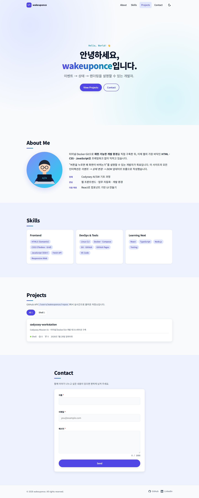
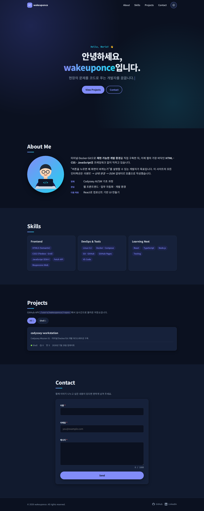
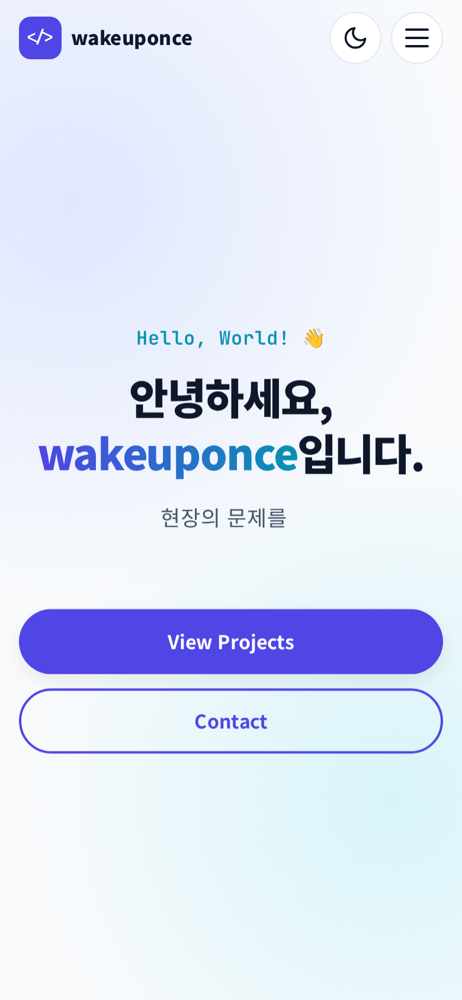
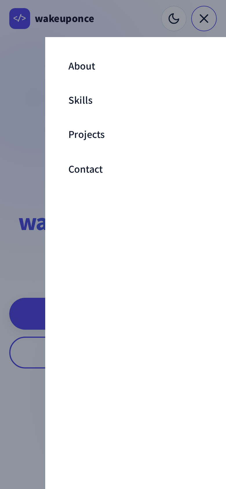
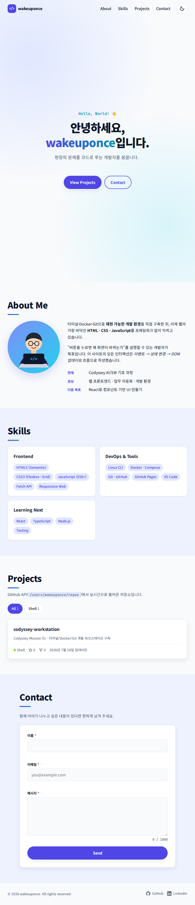
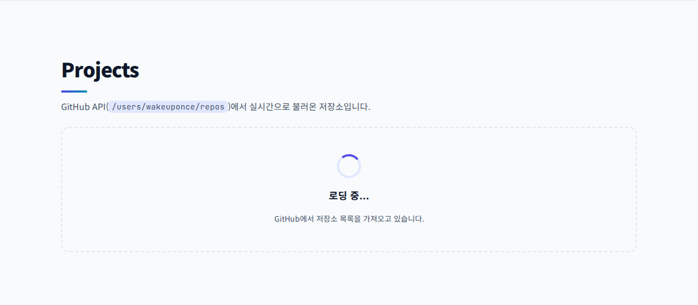
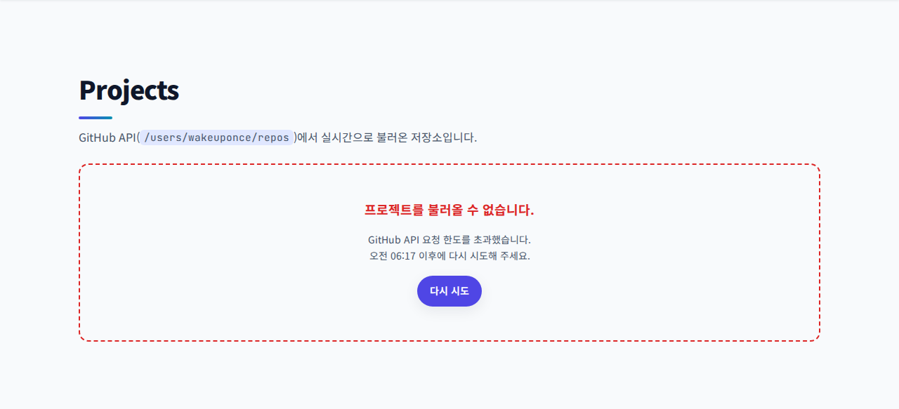
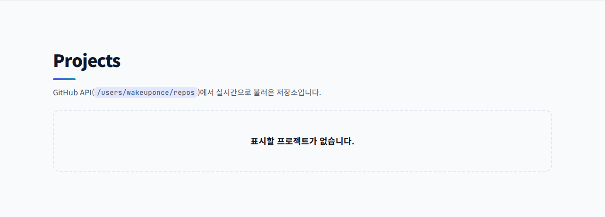
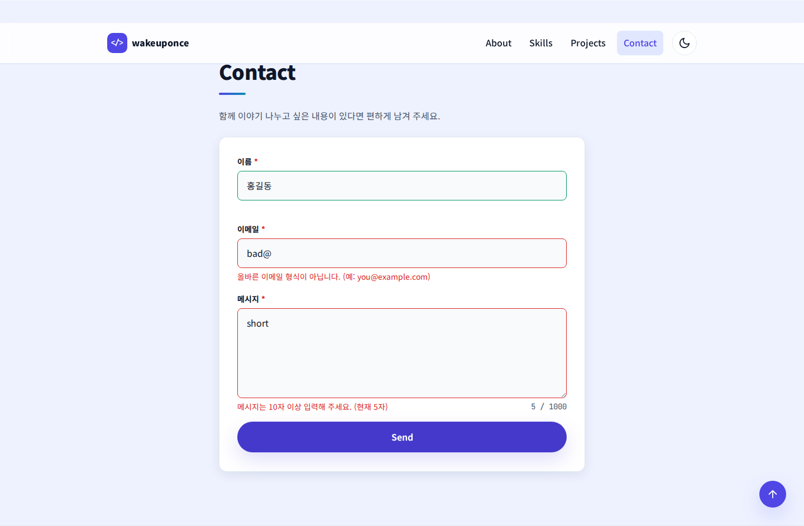
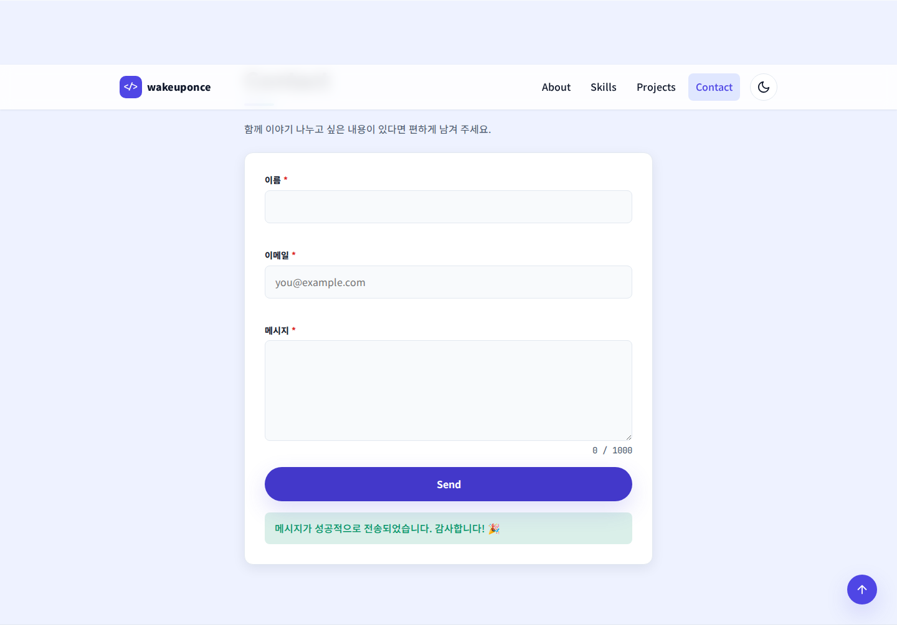

# Codyssey Mission 02 · 나를 소개하는 웹페이지

외부 라이브러리 없이 **순수 HTML · CSS · JavaScript** 만으로 만든 반응형 포트폴리오입니다.
화면을 그리는 것보다 **"사용자 이벤트 → 상태 변경 → DOM 업데이트"** 흐름을 코드로 명확히 드러내는 데 집중했습니다.

| 항목 | 내용 |
|---|---|
| 배포 URL | **https://wakeuponce.github.io/codyssey-workstation/** |
| 저장소 | https://github.com/wakeuponce/codyssey-workstation (`portfolio/` 폴더) |
| 사용 기술 | HTML5(시맨틱), CSS3(변수·Flexbox·Grid·미디어쿼리), JavaScript ES6+(DOM·이벤트·fetch·async/await·Intersection Observer) |
| 허용 외부 리소스 | Google Fonts(Noto Sans KR, JetBrains Mono)만 사용. 아이콘은 인라인 SVG |
| 대상 브라우저 | 최신 Chrome |

---

## 1. 스크린샷

| 데스크톱 (라이트) | 데스크톱 (다크) |
|---|---|
|  |  |

| 모바일 첫 화면 | 모바일 햄버거 메뉴 | 태블릿 (820px) |
|---|---|---|
|  |  |  |

**Projects 상태별 UI**

| 로딩 | 에러 (403 레이트 리밋) | 빈 상태 |
|---|---|---|
|  |  |  |

**폼 유효성 검사**

| 에러 표시 | 전송 성공 |
|---|---|
|  |  |

> 전체 모바일 스크롤 캡처: [`docs/screenshots/mobile-full.png`](docs/screenshots/mobile-full.png)
>
> 위 이미지는 Chromium(Playwright)으로 로컬 서버를 띄워 촬영했습니다. 촬영 환경에서 `api.github.com/users/...` 경로가 막혀 있어,
> GitHub API 응답을 **실제 저장소 정보(`/repos/wakeuponce/codyssey-workstation`)로 가로채** 넣었고,
> 에러 화면은 403 + `x-ratelimit-remaining: 0` 응답을 만들어 촬영했습니다. 배포 사이트에서는 실제 API를 호출합니다.

---

## 2. 폴더 구조

```
portfolio/
├── index.html          # 메인 페이지 (시맨틱 마크업)
├── .nojekyll           # GitHub Pages 가 Jekyll 처리 없이 그대로 서빙
├── css/
│   └── style.css       # 모바일 퍼스트 스타일 · CSS 변수 · 다크 테마
├── js/
│   ├── config.js       # 설정값 (GitHub 아이디, 스크롤 기준값, threshold 등)
│   └── main.js         # 기능 전체 (상태 저장소 + 이벤트 + 렌더링)
├── images/
│   ├── profile.svg     # 프로필 일러스트
│   └── favicon.svg
└── docs/screenshots/   # README 용 스크린샷
```

`index.html` 에서 외부 파일을 이렇게 연결합니다. 두 스크립트 모두 **`defer`** 라 HTML 파싱을 막지 않고, DOM 이 준비된 뒤 **작성 순서대로** 실행됩니다 (`config.js` → `main.js`).

```html
<link rel="stylesheet" href="css/style.css">
<script src="js/config.js" defer></script>
<script src="js/main.js" defer></script>
```

## 3. 로컬 실행

**VS Code + Live Server**
1. VS Code 에서 저장소를 열고 확장 `Live Server`(ritwickdey.LiveServer) 설치
2. `portfolio/index.html` 우클릭 → **Open with Live Server** → `http://127.0.0.1:5500/portfolio/` 에서 저장할 때마다 자동 새로고침

(확장 없이) `cd portfolio && python3 -m http.server 5500` 후 `http://localhost:5500` 접속도 가능합니다.

### 상태 확인용 데모 모드

API 상태를 일부러 만들기 어려우므로, 주소 뒤에 쿼리를 붙이면 해당 상태를 강제로 볼 수 있습니다.

| URL | 결과 |
|---|---|
| `?demo=loading` | 스피너가 계속 보이는 로딩 상태 |
| `?demo=error` | "프로젝트를 불러올 수 없습니다" + **다시 시도** 버튼 |
| `?demo=empty` | "표시할 프로젝트가 없습니다" |

예: https://wakeuponce.github.io/codyssey-workstation/?demo=error#projects

## 4. 배포 (GitHub Pages)

저장소 루트는 Mission 01 결과물이므로, `portfolio/` 폴더만 GitHub Actions 로 배포합니다 ([`.github/workflows/deploy-portfolio.yml`](../.github/workflows/deploy-portfolio.yml)).

1. 저장소 **Settings → Pages → Build and deployment → Source: GitHub Actions** 선택 (최초 1회)
2. `main` 브랜치에 `portfolio/**` 변경이 push 되면 자동 배포 (Actions 탭에서 수동 실행도 가능)
3. 배포 주소: `https://wakeuponce.github.io/codyssey-workstation/`

---

## 5. 기준값 (요구사항에서 README 명시를 요구한 값)

모두 [`js/config.js`](js/config.js) 한 곳에서 관리합니다.

| 기능 | 값 | 동작 |
|---|---|---|
| 네비게이션 스타일 변경 | **60px** (`navScrollThreshold`) | 스크롤 60px 이상 → 헤더에 `.scrolled` → 반투명 배경 + 그림자 |
| 스크롤 탑 버튼 | **300px** (`scrollTopThreshold`) | 스크롤 300px 이상 → 버튼에 `.visible` → 페이드인, 클릭 시 맨 위로 |
| 스크롤 애니메이션 | **threshold 0.2** (`revealThreshold`) | `.reveal` 요소가 20% 보이면 `.is-visible` → 아래에서 떠오름 (1회) |
| API 캐시 | **10분** (`cacheTtlMs`) | 같은 탭에서 새로고침해도 10분간은 sessionStorage 캐시 사용 → 시간당 60회 제한 보호. "다시 시도" 는 캐시 무시 |
| API 타임아웃 | **10초** (`requestTimeoutMs`) | 응답이 없으면 `AbortController` 로 중단 → 에러 상태 |
| 반응형 브레이크포인트 | **768px / 1024px** | 태블릿: 가로 메뉴·2열 / 데스크톱: 3열·큰 글자 |

---

## 6. 요구사항 충족 표

| 요구사항 | 구현 위치 |
|---|---|
| 시맨틱 태그 `header/nav/main/section/article/footer` | `index.html` 전체. Skills·Projects 카드는 `<article>` |
| Hero · About · Skills · Projects · Contact · Footer | `#hero` `#about` `#skills` `#projects` `#contact` `footer` |
| 네비게이션 앵커 링크 | `.nav__menu a[href="#..."]` |
| 이미지 `alt` | 프로필 이미지 `alt="노트북 앞에서 코드를 작성하는 ... 일러스트 프로필"` (아이콘 SVG는 `aria-hidden`) |
| `<label for>` ↔ `id` | `name` `email` `message` 3개 모두 매칭 + `aria-describedby` 로 에러 문구 연결 |
| CSS 변수 `:root` / 다크 `[data-theme="dark"]` | `style.css` 1·2장 |
| 네비게이션 Flexbox | `.nav { display:flex; justify-content:space-between }` |
| Projects Grid `auto-fit` + `minmax` | `.projects__grid { grid-template-columns: repeat(auto-fit, minmax(min(100%, 280px), 1fr)) }` |
| 모바일 퍼스트 + 768/1024 | 기본 = 모바일, `@media (min-width: 768px)`, `@media (min-width: 1024px)` |
| 모바일 햄버거 | 768px 미만에서 메뉴는 오른쪽 드로어로 숨김, `.hamburger` 표시 |
| hover + transition, box-shadow | `.btn`, `.skill-card`, `.project-card`, `.icon-btn`, `.social__link` |
| `defer` / `const`·`let` 만 / `onclick` 없음 / 인라인 `style` 없음 | 전 파일 `var`, `onclick=`, `style=` 0건 |
| `querySelector(All)` | `$` / `$$` 헬퍼 (`main.js` 0장) |
| `textContent` / `innerHTML` | 에러 문구·카운터·타이핑 = `textContent`, 카드·상태 UI = `innerHTML` |
| `classList.add/remove/toggle` | `.active` `.scrolled` `.visible` `.is-visible` `.is-invalid` 등 |
| `click` `submit` `scroll` `input` 이벤트 | 햄버거·테마·필터·재시도 / 폼 제출 / 헤더·탑버튼 / 폼 입력 |
| `event.preventDefault()` | 앵커 클릭(부드러운 스크롤), 폼 제출 |
| 햄버거 토글 `classList.toggle('active')` | `renderMenu` — 다시 누르면 닫힘. 링크 클릭·ESC·바깥 클릭·화면 확대 시에도 닫힘 |
| 부드러운 스크롤 | `scrollIntoView({ behavior: 'smooth' })` + CSS `scroll-behavior` + `scroll-margin-top`(고정 헤더 보정) |
| 다크 모드 + localStorage 유지 | 키 `theme` 에 `light`/`dark` 저장 |
| Intersection Observer | 등장 애니메이션(threshold 0.2) + 현재 섹션 메뉴 강조 |
| 폼: 필수값·이메일 형식·필드 옆 에러·성공 메시지 | `validators` 객체, `.field__error`, `.form-status` |
| 화살표 함수·템플릿 리터럴·구조분해·`map/filter/forEach` | 7장 참고 |
| `fetch` + `async/await` + `try/catch` | `fetchRepos`, `loadProjects` |
| 로딩 / 성공 / 에러(+재시도) / 빈 상태 | `renderProjects` 의 `status` 분기 |
| 403 레이트 리밋 → 에러 UI | `x-ratelimit-remaining: 0` 이면 "요청 한도 초과, HH:MM 이후 재시도" 표시 |

### 보너스
| 과제 | 구현 |
|---|---|
| 언어별 필터 | 받아온 저장소의 언어로 버튼 자동 생성(개수 표시) → `repos.filter(({ language }) => language === filter)` |
| 타이핑 효과 | Hero 문구를 한 글자씩 쓰고 지우기 반복 (`setTimeout` 루프). 모션 최소화 설정 시 정적 표시 |
| 폼 실제 전송 | `config.js` 의 `formEndpoint` 에 Formspree 주소를 넣으면 실제 POST. 비워 두면 0.8초 전송 시뮬레이션 |
| 시스템 다크 모드 감지 | 저장값이 없으면 `prefers-color-scheme` 을 따르고, OS 설정이 바뀌면 실시간 반영 |

---

## 7. 설계 설명 (과제 목표별)

### 7-1. 왜 시맨틱 태그인가, 구조를 나눈 기준

`div` 는 "덩어리" 라는 뜻밖에 없지만 `header`·`nav`·`main`·`section`·`article`·`footer` 는 **그 영역이 무엇인지** 를 브라우저·스크린리더·검색엔진에 알려 줍니다. 스크린리더 사용자는 랜드마크 단위로 바로 이동할 수 있고, 코드를 읽는 사람도 구조를 한눈에 파악합니다.

구조 설계 기준은 다음과 같습니다.
- **페이지에 하나뿐인 것** → `header`(로고+메뉴), `main`(본문), `footer`(저작권·소셜)
- **메뉴에서 이동할 수 있는 주제 단위** → `section` + 고유 `id` + 제목(`h2`)과 `aria-labelledby` 로 연결
- **떼어서 다른 곳에 놓아도 의미가 통하는 독립 콘텐츠** → `article` (프로젝트 카드 하나, 스킬 묶음 하나)
- 제목 계층은 `h1`(Hero 1개) → `h2`(섹션) → `h3`(카드) 로 건너뛰지 않음

### 7-2. Flexbox vs Grid

| | Flexbox | Grid |
|---|---|---|
| 축 | **1차원** (한 줄: 가로 또는 세로) | **2차원** (행과 열 동시) |
| 크기 결정 | 콘텐츠 크기가 먼저, 남는 공간 분배 | 레이아웃(틀)이 먼저, 콘텐츠가 칸에 들어감 |
| 이 사이트에서 | 네비게이션(로고 ↔ 메뉴), 버튼 그룹, 태그 목록, 카드 하단 메타 정보, 푸터 | 프로젝트 카드 목록, Skills 3열, 폼 필드 간격 |

선택 기준: **"한 줄로 늘어놓고 정렬만 하면 된다" → Flexbox**, **"행과 열이 맞아야 하는 격자" → Grid**.
특히 프로젝트 카드는 `repeat(auto-fit, minmax(min(100%, 280px), 1fr))` 한 줄로, 미디어쿼리 없이도 폭에 따라 1→2→3열로 자동 전환됩니다.

### 7-3. `querySelector` → `addEventListener` 흐름

```js
const hamburger = $('.hamburger');            // 1) 요소 선택 (querySelector)
hamburger.addEventListener('click', () => {    // 2) 이벤트 연결
  menuStore.set((prev) => ({ isOpen: !prev.isOpen }));  // 3) 상태 변경
});
// 4) store 가 renderMenu 호출 → navMenu.classList.toggle('active', isOpen)
```

동적으로 생기는 요소(재시도 버튼, 필터 버튼)는 렌더링 때마다 새로 만들어지므로, 매번 리스너를 붙이지 않고 **변하지 않는 부모에 한 번만 붙이는 이벤트 위임**(`event.target.closest('.js-retry')`)을 사용했습니다.

### 7-4. ES6+ 문법을 쓰는 이유

- **화살표 함수**: 짧은 콜백(`repos.map(projectCardTemplate)`, 이벤트 핸들러)을 간결하게. 자기 `this` 가 없어 콜백 안에서 헷갈릴 일이 없음
- **구조분해 할당**: API 응답에서 필요한 필드만 꺼내며 이름까지 바꿈
  ```js
  const toProject = ({ name, html_url: url, stargazers_count: stars, language }) => ({ ... });
  entries.forEach(({ isIntersecting, target }) => { ... });
  ```
- **템플릿 리터럴**: 데이터 → HTML 문자열 변환 (`projectCardTemplate`). 외부 데이터는 `escapeHtml` 로 이스케이프해 XSS 차단
- **배열 메서드**: `for` 문 대신 "무엇을 할지" 만 표현
  - `filter` — 포크/보관 저장소 제외, 언어 필터
  - `map` — 원본 응답 → 화면용 객체 → 카드 HTML
  - `forEach` — 여러 요소에 옵저버·클래스 적용
  - `reduce` — 언어별 개수 집계

### 7-5. `fetch` + `async/await` 와 상태 UI

```js
const loadProjects = async (options) => {
  projectsStore.set({ status: 'loading' });                 // → 스피너
  try {
    const repos = await fetchRepos(options);
    projectsStore.set({ status: 'success', repos });       // → 카드 또는 빈 상태
  } catch (error) {
    projectsStore.set({ status: 'error', error: {...} });  // → 에러 + 다시 시도
  }
};
```

- `fetch` 는 404·403 에서도 **예외를 던지지 않으므로** `response.ok` 를 직접 확인해 `GitHubError` 로 바꿔 던짐
- 403/429 + `x-ratelimit-remaining: 0` → "요청 한도 초과" + 리셋 시각 안내
- 네트워크 끊김·타임아웃(AbortController)도 모두 `catch` 로 모여 같은 에러 UI
- 성공인데 배열이 비었으면 "표시할 프로젝트가 없습니다", 필터 결과가 없으면 "○○ 언어의 프로젝트가 없습니다"
- 재시도 버튼은 캐시를 무시하고 다시 요청

### 7-6. 이벤트 → 상태 → 렌더링 (React 의 기초)

`main.js` 의 `createStore(initialState, render)` 는 React `useState` 를 흉내 낸 20줄짜리 함수입니다.
`set()` 으로 상태를 바꾸면 **자동으로 `render(state)` 가 호출**되고, render 함수는 현재 상태만 보고 DOM 을 맞춥니다.
이벤트 핸들러는 DOM 을 직접 건드리지 않고 상태만 바꿉니다.

| # | 이벤트 | 상태 | 렌더링 결과 |
|---|---|---|---|
| 1 | 테마 버튼 `click` / OS 테마 `change` | `themeStore { theme }` | `<html data-theme>` 변경 → CSS 변수 교체로 전체 색 전환, 아이콘·`aria-pressed` 갱신, localStorage 저장 |
| 2 | 페이지 로드 · 재시도 `click` | `projectsStore { status, repos, error }` | 스피너 / 카드 그리드 / 에러+재시도 / 빈 상태 |
| 3 | 필터 버튼 `click` | `projectsStore { filter }` | 활성 버튼 강조 + 해당 언어 카드만 표시 |
| 4 | 폼 `input` · `focusout` · `submit` | `formStore { values, errors, touched, status }` | 필드별 에러 문구·빨강/초록 테두리, 글자 수, 버튼 "전송 중..." 비활성, 성공/실패 메시지 |
| 5 | 햄버거 `click` · ESC · 바깥 클릭 | `menuStore { isOpen }` | 드로어 `.active`, X 아이콘, `aria-expanded`, 배경 스크롤 잠금 |
| 6 | 창 `scroll` | `scrollStore { y }` | 헤더 `.scrolled`(≥60px), 탑 버튼 `.visible`(≥300px) |

React 로 옮기면 `createStore` → `useState`, render 함수 → 컴포넌트의 JSX 반환, 템플릿 리터럴 → JSX, 이벤트 위임 → `onClick` props 가 됩니다.

---

## 8. 검증 결과

Headless Chromium(Playwright)으로 자동 확인한 항목입니다.

| 항목 | 결과 |
|---|---|
| 스크롤 100px → 헤더 `.scrolled` 부여, 탑 버튼 숨김 / 400px → 탑 버튼 표시 | ✅ |
| 메뉴 `Projects` 클릭 → `#projects` 로 이동, 헤더 높이만큼 보정, URL 해시 갱신 | ✅ |
| 빈 폼 제출 → 3개 필드 모두 에러, 첫 에러 필드(이름)로 포커스 | ✅ |
| `bad@` / 5자 메시지 → 이메일 형식·10자 이상 에러 | ✅ |
| 올바른 값 제출 → 성공 메시지, 폼 초기화 | ✅ |
| 다크 모드 클릭 → `data-theme="dark"`, localStorage 저장 → **새로고침 후 유지** | ✅ |
| 모바일(390px): 메뉴 숨김·햄버거 표시 → 클릭 시 열림 → 다시 클릭 시 닫힘 → 링크 클릭 시 닫히며 이동 | ✅ |
| 모바일 가로 스크롤(overflow-x) | 0px ✅ |
| 로딩 / 403 에러 → 재시도 성공 / 빈 상태 | ✅ |
| 콘솔 JS 에러 | 없음 (의도한 403 응답 로그 제외) |

## 9. 트러블슈팅 메모

- **모바일 드로어가 헤더 높이로 잘리는 문제**: 스크롤 시 헤더에 `backdrop-filter` 를 주자 `position: fixed` 인 메뉴의 기준 박스가 뷰포트가 아니라 헤더로 바뀌었습니다. (`backdrop-filter`·`transform`·`filter` 는 fixed 자식의 containing block 을 만듦) → `backdrop-filter` 를 가로 메뉴가 되는 768px 이상에서만 적용해 해결했습니다.
- **고정 헤더에 섹션 제목이 가려지는 문제**: `section { scroll-margin-top: var(--header-h) }` 로 앵커 이동 위치를 헤더 높이만큼 내렸습니다.
- **JS 실패 시 콘텐츠가 안 보이는 위험**: 등장 애니메이션의 `opacity: 0` 은 `html.js .reveal` 에만 적용되도록 해, JS 가 로드되지 않아도 내용은 보입니다.
